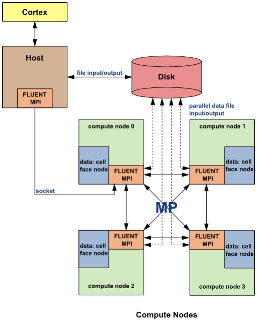
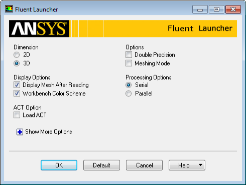
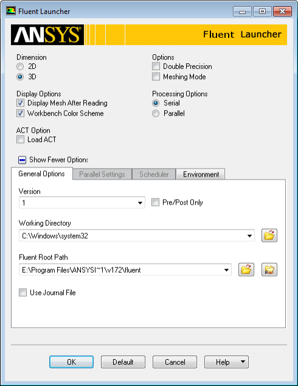
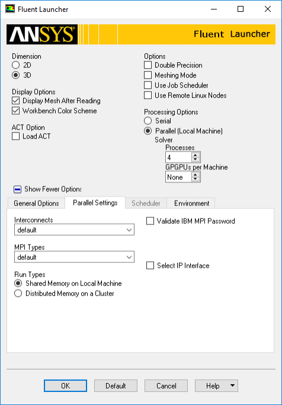
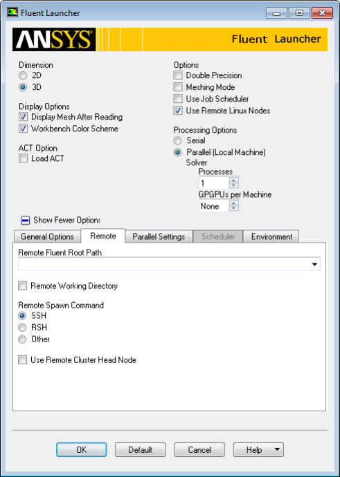
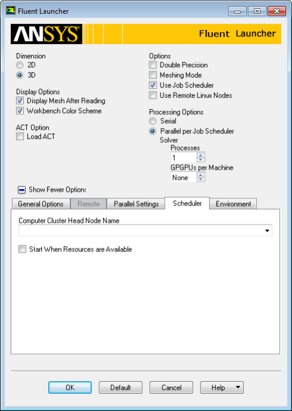
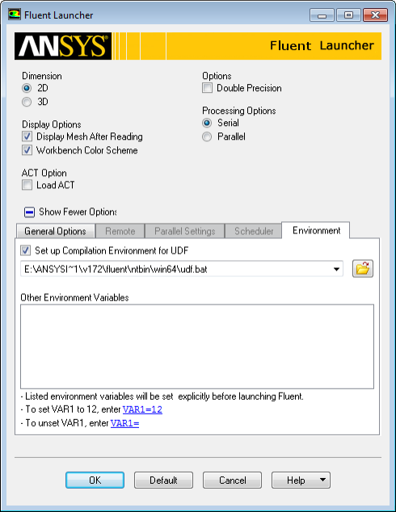
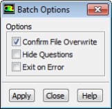
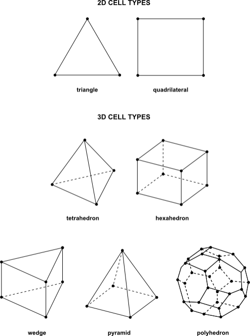

# Fluent 入门指南
***
## 第一章 ANSYS Fluent简介
***
ANSYS FLUENT是一个先进的计算机程序，用于模拟复杂几何形状中的流体流动、传热和化学反应。

ANSYS Fluent是用C语言编写的，充分利用了C语言提供的灵活性和强大功能。 因此，真正的动态内存分配、高效的数据结构和灵活的求解器控制都是可能的。 此外，ANSYS Fluent采用了客户机/服务器体系结构，使其能够在客户机桌面工作站和功能强大的计算服务器上作为单独的并发进程运行。 这种体系结构允许高效的执行、交互控制，同时在不同类型的机器或操作系统之间具有完全的灵活性。

ANSYS Fluent提供了完全的网格灵活性，包括使用非结构化网格解决流动问题的能力，这些网格可以相对容易地生成复杂的几何形状。 支持的网格类型包括2D三角形/四边形、3D四面体/六面体/金字塔/楔形/多面体和混合（混合）网格。 ANSYS Fluent还允许您根据流动解来细化或粗化网格。

您可以将您的网格读入ANSYS Fluent，或者对于3D几何图形，使用Fluent的网格模式创建您的网格（更多细节请参阅**Fluent用户指南**）。所有剩余的操作在Fluent的求解模式下执行，包括设置边界条件、定义流体性质、进行求解、细化网格以及后处理和查看结果。

ANSYS Fluent串行求解器使用单个计算机上的单个求解器进程来管理文件输入和输出、数据存储和流场计算。 Ansys Fluent还使用了一个名为***cortex***的实用程序管理ANSYS Fluent的用户界面和基本图形功能。ANSYS Fluent的并行求解器使您能够使用在同一台计算机上执行的多个进程或在网络中的不同计算机上执行的多个进程来计算解决方案。

ANSYS Fluent的求解器管理文件输入和输出、数据存储和流场计算。 过程涉及ANSYS Fluent、主机进程和一个或多个计算节点进程之间的交互。 ANSYS Fluent使用一个管理ANSYS Fluent的用户界面和基本图形功能的名为***cortex***的实用程序与主机进程和计算节点交互。

ANSYS Fluent的串行求解器使用单个计算节点，而并行求解器使用可能在同一台计算机上或在网络中的不同计算机上执行的多个计算节点来求解。

有关ANSYS Fluent的并行处理能力、消息传递接口(MPI)等的更多信息，请参见**用户指南**中的**并行处理**部分。

计算求解和显示结果所需的所有功能都可以在ANSYS Fluent中通过一个交互式界面访问。

更多详细信息，请参阅以下各节：   
  **1.1. ANSYS产品改进计划**   
  **1.2. 程序能力**   
  **1.3. ANSYS Fluent 19.2中已知的限制**

***
### 1.1 ANSYS产品改进计划

ANSYS产品改进计划涵盖了本产品，使ANSYS有限公司能够收集和分析在不影响您的工作或产品性能的情况下报告的匿名使用数据。 分析产品使用数据有助于我们了解客户使用趋势和模式、兴趣以及质量或性能问题。 这些数据使我们能够开发或增强产品功能，更好地满足您的需求。

#### 如何参与

这个项目是自愿的。 要参与，请在出现“产品改进计划”对话框时选择**YES**。 只有在这以后，才会开始收集此产品的数据。

#### 程序如何工作

在您同意参与后，产品将在每个会话期间收集匿名使用数据。 结束会话时，收集的数据将发送到只有授权的ANSYS员工才能访问的安全服务器。 ANSYS接收到数据后，利用分布、计数、均值、中值、模态等各种统计手段对数据进行理解和分析。

#### 我们收集的数据

我们在ANSYS产品改进计划下收集的数据是有限的。 所收集数据的类型和数量因产品而异。通常，数据属于以下列出的类别:    

**硬件:** 有关运行产品的硬件的信息，如:

•CPU的品牌和类型

•可用处理器数

•可用内存量

•显卡的品牌和类型

**系统:** 有关运行产品的系统的配置信息，如:

•操作系统和版本

•国家代码

•时区

•使用的语言

•产品使用的环境变量值

**终端会话：** 会话的特性，如:

•交互式或批量设置

•持续时间

•使用的CPU总时间

•正在使用的产品许可证和许可证设置

•产品版本和内部版本标识符

•使用的命令行选项

•使用的处理器数量

•使用的内存量

•发出的错误和警告 

**会话操作:** 会话期间某些用户操作的计数，如:

•项目保存

•重新启动

•网格划分、求解、后处理等操作

•使用帮助系统的次数

•使用向导的次数

•工具栏选择 

**模型：** 仿真中使用的模型的统计信息，如:

•所用实体的数量和类型，如节点、元素、单元、曲面、基元等。

•材料类型、加载类型、边界条件、种类等的数量

•所用坐标系的数目和类型

•使用的单位制

•维数(1-D，2-D，3-D) 

**分析** 分析的特征，如:

•使用的物理类型

•线性和非线性行为

•时域和频域（静态、稳态、瞬态、模态、谐波等）

•使用的分析选项 

**解决方案:** 所执行解决方案的特性，包括:

•求解器和求解器选项的选择

•使用的解决方案控件，如收敛条件、精度设置和优化选项。

•求解器统计，如方程的数量，加载步骤的数量，设置点的数量等。

**特殊：** 使用的特殊选项或功能，如:

•用户提供的插件和例程

•与ANSYS其他产品的耦合分析

#### 我们不会收集的数据

产品改进计划将不会收集任何可以识别您个人、您的公司或您的知识产权的信息。 这包括但不限于：

•名称、地址或用户名

•文件名、部件名或其他用户提供的标签

•几何或设计专用输入，如坐标值或位置、厚度或其他尺寸值

•材料属性、载荷或用户提供的任何其他实际值数据的实际值

除了只收集匿名数据外，我们不记录从何处收集数据。 因此，我们无法将收集的数据与任何特定客户、公司或位置相关联。

#### 选择退出项目

您可以随时停止参与本计划。为此，请从Help菜单中选择**ANSYS Product
Improvement Program**。将出现一个对话框，询问您是否要继续参与项目。选择**No** ,然后单击**OK**,将不再收集或发送数据。

#### ANSYS公司隐私政策

所有ANSYS产品都包含在ANSYS公司隐私政策中。

#### 常见问题

*1.我必须参加这个计划吗？*

不，你是自愿参加的。 我们鼓励您的参与，然而，因为它帮助我们创造的产品，将更好地满足您的未来需求。

*2.我是否自动注册此计划？*

不。除非您明确同意参加，否则您将无法注册。 

*3.参加这个项目是否会使我的知识产权面临被ANSYS收集或发现的风险？*

否。我们不收集任何特定于项目、特定于公司或特定于型号的信息。

*4.即使我同意参与，我还能停止参与吗？*

是的，你可以随时停止参与。 为此，请选择**ANSYS Product
Improvement Program**，从“帮助”菜单中。 将出现一个对话框，询问您是否要继续参加该计划。选择**NO** ，然后单击**OK**。将不再收集或发送数据。

*5.参加这个项目会降低产品的性能吗？*

否，数据收集不会以任何显着方式影响产品性能。 所收集的数据非常少。

*6.数据收集和发送到ANSYS服务器的频率是多少？*

数据是在产品的每次使用会话期间收集的。 在退出产品时，每个会话将收集的数据发送到安全服务器一次。

*7.此程序是否适用于所有ANSYS产品？*

现在还不行，尽管我们在每个版本中都会将它添加到更多的产品中。 只有在以下情况下，程序才能在产品中使用: ANSYS产品改进计划产品文档中会出现说明，与此产品的说明一样。 

*8.如果我注册此产品的程序，是否自动注册同一台计算机上使用的其他ANSYS产品的程序？*

是。 您的注册选择适用于您在同一台计算机上使用的所有ANSYS产品。 类似地，如果您结束一个产品在程序中的注册，则结束该计算机上所有ANSYS产品的注册。

9.如果我在集群中使用ANSYS产品，如何确定产品改进计划中的注册？

在集群配置中，产品改进计划注册由主机设置确定。

### 1.2.1 程序功能

在网格划分模式下，ANSYS Fluent作为一个强大的非结构化体网格生成器（更多详细信息参见**Fluent用户指南**中的**网格模式功能**）。在求解模式下，Fluent允许您模拟以下内容:

•2D平面、2D轴对称、2D轴对称（旋转对称）和3D流体

•四边形、三角形、六面体（砖形）、四面体、楔形、棱锥、多面体和混合单元网格上的流动

•稳态或瞬变流

•不可压缩或可压缩流，包括所有速度区（低亚音速、跨音速、超音速和高超音速流）

•无粘、层流和紊流

•牛顿流或非牛顿流

•理想气体或实际气体

•传热，包括强迫对流、自然对流和混合对流、共轭（固体/流体）传热和辐射

•化学物质的混合和反应，包括均相和非均相燃烧模型和表面沉积/反应模型

•气-液、气-固和液-固流动的自由表面和多相模型

•离散相（颗粒/液滴/气泡）的拉格朗日轨迹计算，包括与连续相的耦合和溅射模型

•气穴模型模拟

•相变模型在熔化/凝固中的应用

•具有非各向同性渗透率、惯性阻力、固体热传导和多孔面压力跃变条件的多孔介质

•风扇、泵、散热器和热交换器的集中参数模型

•预测流致噪声的声学模型

•惯性（静止）或非惯性（旋转或加速）参考系

•使用多个参考系(MRF)和滑动网格选项的多个移动系

•具有质量守恒和涡流守恒选项的转子-定子干扰、变矩器和类似涡轮机应用的混合平面模型模拟

•移动变形网格域的动态网格模型模拟

•质量、动量、热量和化学物质的体积来源

•使用材料属性数据库的模拟

•使用伴随求解器或网格变形器/优化器修改或优化设计的模拟

•用户定义函数自定义的模拟

•GT-POWER与WAVE的动力学（双向）耦合

•使用以下附加模块的模拟（单独文件）:

-电池模块

-连续光纤模块

-宏观粒子模型(MPM)模块

-燃料电池模块

-磁流体动力学(MHD)模块

-群体平衡模块

•作为服务器（单独文件）

ANSYS FLUENT非常适合于复杂几何形状的不可压缩和可压缩流体流动模拟。 ANSYS Fluent的并行求解器使您能够在多个处理器上计算具有非常大网格的情况下的解决方案。 ANSYS公司还提供了其他解决方案，解决不同特性的流体，并纳入了其他的物理模型。 ANSYS公司的其它CFD程序包括CFX、ANSYS Icepak和ANSYS Polyflow。

### 1.3 ANSYS Fluent 19.2中已知的限制

本节列出了ANSYS Fluent中存在的已知限制。 在可能的情况下，提供了建议的解决办法。 

•文件导入/导出（有关受支持文件的列表，请参阅本节中位于**第三方软件**下方的信息）

-如果更改自动保存对话框中**文件存储选项**中的设置，求解历史记录将丢失。

-数据导出到力学APDL结果文件在Linx64平台上不可用。 （力学APDL数据导出到.cdb文件在所有平台上都可用。）

-导出Ensight Case Gold文件进行瞬态仿真时，求解器不能在串行和并行之间切换，并且不能更改给定并行运行的计算节点数。 否则，导出的每个时间步骤的Ensight Case Gold文件将不兼容。

-不支持Ensight导出拓扑转变。

-为了恰当表现来自串行或并行ANSYS Fluent仿真的结果 (*.fvuns*): 

→网格文件必须使用*fieldview-unstruct-grid*文本命令。

→网格和数据文件都应该从具有相同节点数的并行ANSYS Fluent会话导出。

-tecplot文件导入不支持tecplot360文件格式。

-在一个Fluent会话中最多可以读取50个配置文件。

-分层数据格式文件I/O的并行独立模式已知表现出较慢的写性能。 在并行文件系统上，在编写HDF文件时，请考虑使用并行集体模式。 在其他网络文件系统上，请考虑使用主机或Node0模式。

-如果使用通用命名约定(UNC)路径访问文件，则必须确保您具有访问路径中所有文件夹的权限，否则将无法打开该文件。

•网格

-无法从具有挂起节点的面扩展边界区域。

–对于涉及流体、力学和网格应用程序的模拟，在存在多个区域和它们之间的接触的情况下可能会出现网格问题。 在Fluent中，区域只能存在于单个接触区域中。 与Fluent相比，力学和网格应用程序在接触区域方面都使用了不同的方法。

–ANSYS Fluent不支持边缘的FSI数据映射，因此在2D中不支持。

-在非保角界面处，**Matching** 选项不再允许使用**Mapped** 选项。 在启用这两个选项的情况下打开以前版本中设置的用例时，系统将提示您重新创建接口，而不使用**Matching**选项。

-如果您的网格拓扑结构在墙壁附近有一个阶梯形棱柱网格，则不要对MUSCL使用基于节点的梯度。

-对于使用多面体非结构网格适配(PUMA)方法执行适配的壳体传导情况，如果试图在与多个计算节点的并行会话中提高网格质量，ANSYS Fluent可能会异常终止。**解决方法**: 在使用PUMA方法之后，您必须保存case文件并将其读回到Fluent中，然后才能提高网格质量。

•模型

-ANSYS Fluent仅支持OPPDIF Flamelet Import的Chemkin II格式。

-表面对表面(S2S)辐射模型不适用于移动/变形网格。

-DPM工作桩算法与墙膜边界条件不兼容。

-壳传导模型不适用于移动墙壁。

-热交换器模型与网格自适应不兼容。

-Fluent/ANSYS反应设计动力学耦合器在Win64平台上不可用。

-DO-能量耦合仅适用于大光学厚度(>10)的情况。

-FMG初始化不适用于外壳传导模型。

-FMG初始化与非稳定求解器不兼容。

–MHD模块与欧拉多相模型不兼容。

-时间上有界的二阶离散与移动和变形网格不兼容。

-在模拟多孔介质时，如果启用了非平衡热模型，则**Porosity** 的值（定义于**Fluid** 对话框）不能是0或1（即，它必须介于这些值之间）。

–在模拟多孔介质时，辐射和/或多相模型不支持非平衡热模型。

–对于多孔介质模拟，当存在非零涡流阻力时，相对速度阻力公式不支持轴对称无旋涡流。

-壳导通的墙体与非保角耦合墙体的结合都不受支持。 这样的接合部不会热连接，也就是说，在壳体和网状界面壁之间不会有热传递。

-启用Eulerian Wall薄膜模型后，Fluent将不允许您保存网格修改，如分离单元格、挤压面部区域和更改单元格区域类型。 如果您想修改Fluent中的网格，确保在启用Eulerian Wall薄膜模型之前完成所有的网格操作。

-过渡SST模型（也称为γ-Reθ模型）不是伽利略不变量，因此不使用于相对于计算速度场的坐标系移动的表面； 对于这种情况，应用间歇性转换模型（也称为γ模型）来替代。

–在使用离散相模型的模拟中，当模拟以恒定包大小释放的瞬态颗粒时，结合案例文件的自动保存，可能会丢失颗粒质量。

-用户定义的边界函数与欧拉多相公式不兼容，不能使用。 

-Fluent版本16.0或16.1的表面对表面辐射模型计算中生成的视图因子文件可能与较新版本不兼容，如果**Matching** 选项已为映射接口启用。 对于具有这种设置的任何案例文件，必须在较新版本中重新计算视图因子，以确保结果正确。

•并行处理

-这些功能当前在并行求解程序中不可用:

→离散传输辐射模型(DTRM)

→在Windows10平台上使用Intel MPI选项会导致**mpiexec.exe** 进程在Fluent关闭后，仍保持活动状态。
这是由于Windows 10不支持Intel MPI版本。因此，建议您在Windows10上使用默认的MPI（即IBM MPI）。

-Mellanox OFED版本1.5.3-1.0.0已知在使用内核计数大于约64时会导致随机崩溃或Fluent中的启动问题。 最后一个已知的稳定Mellanox版本是1.5.2。您可以使用以下任一项作为解决方案:

→恢复到OFED 1.5.2。

→在所有机器的驱动程序*24MLX4_CORE* 中把*log_num_mtt* 的值设置为24。

-IBM MPI不支持在过载条件下并行运行（使用的内核比机器上实际可用的内核多）。出于性能原因，通常不建议在过载条件下运行。但是，如果要求它运行过载，则可以使用Intel MPI（*-mpi=intel* ）或打开MPI（-*mpi=openmpi* ）。

-与Fluent一起发行的IBM MPI版本现在对于单个模拟的限制为最多4096个进程。对于更高的核心数，则需要额外的许可证。 更多信息请参见**IBM平台MPI中的进程计数较高(>4096)配置高性能计算指南。**

-注意，在使用大页面进行内存分配的系统（如Cray）上，Fluent报告的虚拟内存使用量可能远远高于实际使用的内存。在这种情况下，常驻内存（也由Fluent报告）是一个更可靠的指导。

-已知退化接触点会导致并行拓扑网状连通性问题。退化联系点是由2个或多个不共享面的单元格区域共享的节点。FLUENT可以通过网格检查串行检测退化的接触点，网格检查的长度设置大于0。 如果案例已经生成了接触点，那么在读取案例之前必须使用以下命令，以便正确地并行处理这些接触点。   
(Rpsetvar 'parallel/add-dgcp-to-int-or-corner？）

–欧拉壁薄膜模型与混合并行DPM跟踪的DPM域选项不兼容。 对于这种模型组合，启用**DPM Domain** 选项，必须禁用**Parallel** 选项卡的离散相模型对话框。

-使用IBM MPI交流库的具有64个以上内核的Windows计算机不支持Fluent进程捆绑（关联）设置，这可能会增加处理时间。作为解决办法，您可以使用Intel MPI或禁用超线程（如果计算机有Intel处理器），以便将内核计数降低到等于或低于64。

-从版本18.0开始，与版本17.0-17.2相比，ANSYS Fluent每个节点进程将需要大约多60MB的内存。

•平台支持和驱动程序

-在Windows Server OS上，ANSYS Fluent只支持MS MPI并行运行。安装任何其他未支持的MPI库（IBM MPI或Intel MPI）将导致冲突。

-在Windows 7及更高版本上，在除*C:* 可能导致因路径名中的空格未转换为短文件名而引起的问题。这是更改从Windows7开始的默认值*NtfsDisable8dot3NameCreation* 的结果。如果您需要将ansys fluent安装在除*C:* 以外必须在安装ANSYS Fluent前运行以下命令:    
*fsutil 8dot3name set < driveletter > 0*

*< driveletter >*是包含冒号的目标驱动器号（例如，D:）。

-Linux的最低操作系统要求是SLES 11 SP2或RHEL 6。

-cpropep.so库的路径名长度（包括库名）限制为80个字符。（Linux Opteron集群仅使用InfiniBand互连。）

-在Linux平台上，不支持在当前工作目录路径中包含空格字符。

-如果您要在已有一个或多个早期版本的ANSYS Fluent的Windows计算机上安装ANSYS Fluent 19.2，则在从系统必备安装IBM MPI和Intel MPI库之后，请确保删除环境变量MPI_ROOT（对于IBM MPI）和I_MPI_ROOT（对于Intel MPI）。否则，在并行模式下运行以前的ANSYS Fluent版本时会发生冲突。

-ANSYS Fluent不再支持远程求解器功能(RSF)。

-不再支持Itanium平台(LNIA64)。

-ANSYS Fluent使用多个TCP/IP端口进行通信和错误处理。 ANSYS Fluent处理与试图使用相同端口的其他程序的端口冲突，并生成类似于以下内容的警告:
*428: mpt_accept: warning: incorrect exercise message "GET /" from 10.1.0.188 on port 56564*
长时间运行的大型会话更容易生成这样的警告，但通常忽略这些警告是安全的。

-在某些较新的硬件上使用默认MPI（IBMMPI），退出Fluent会话时可能会出现以下消息。
*hwloc has encountered what looks like an error from the operating system.* 

*object (Socket cpuset 0xff00ffff) intersection without inclusion!
Error occurred in topology.c line 758*

*Please report this error message to the hwloc user's mailing list,
along with any relevant topology information from your platform.*

此消息来自IBM MPI使用的硬件位置库。您可以设置以下环境变量来隐藏此消息，或者切换到Intel MPI。

*HWLOC_HIDE_ERRORS=1*

-如果在初始化Fluent图形之前锁定计算机屏幕，则在使用OpenGL图形驱动程序时Fluent会话将不会启动。 为了避免OpenGL驱动程序的这个问题，对于Linux/UNIX您可以使用替代驱动程序*X11* 型或*null* ，对Windows可以使用*msw* 或*null* 。您可以通过在*HOOPS_PICTURE* 环境变量中定义图形驱动程序，或者使用*-driver* Fluent命令行选项来指定替代图形驱动程序。

-Fluent在Community Enterprise OS（CentOS）7.3或Red Hat Enterprise Linux(RHEL)7.3上运行时，如果将Display设置为Virtual Network Computing(VNC)会话，则在启动期间可能会异常终止。 若要尝试解决此问题，请验证您使用的是受支持的显卡，并更新显卡驱动程序（直接从显卡供应商网站）。如果问题仍然存在，可以执行以下操作之一:将显示设置为本地计算机； 设置*LD_PRELOAD* 环境变量到*/usr/lib64/libstdc++.so.6*；或使用替代驱动*X11* 或*null* （可以通过在*HOOPS_PICTURE* 环境变量中定义，或者使用*-driver* Fluent命令行选项）。

-在使用默认IBM MPI在Windows上启动Fluent（网格模式或解决方案模式）时，如果安装路径非常长，则可能会收到以下错误消息，并被迫使用任务管理器结束Fluent应用程序: 

*mpirun.exe has stopped working* 

作为解决办法，您可以使用Intel MPI来避免此问题（请注意，在Fluent Launcher中，您只能修改MPI作为并行设置的一部分，因此对于串行情况，您需要选择使用单个处理器并行）；或者，您可以尝试最小化Fluent安装路径中的字符数。（153945）

•远程显示

-在运行FLUENT仿真时连接或断开VPN网络将导致由于网络接口更改而导致的故障。

-如果您在通过远程显示器运行Fluent时遇到异常终止，请检查您的显卡，以确保您拥有最新的现代专业显卡（即该显卡的最新更新驱动程序，可在公司网站上获得）。如果您的系统不符合显卡要求，请使用完全基于软件的驱动程序启动Fluent，如MSW（Windows）或X11（Linux）。

•单元区域和边界条件

–指定为3D风扇区域的流体区域不能有非保角界面。

•求解器

-在压力出口边界处存在强反向流动的情况下，绝对速度公式和相对速度公式可能产生不同的结果。

-非迭代时间推进(NITA)求解器仅适用于有限的一组模型。有关详细信息，请参阅ANSYS Fluent用户指南。

-NITA（使用分数时间步长法）与多孔介质不相容。

-以下模型不适用于基于密度的求解器:

→流体体积(VOF)模型

→多相混合模型

→欧拉多相模型

→非预混燃烧模型

→预混燃烧模型

→部分预混燃烧模型

→化合物PDF传输模型

→烟灰模型

→Rosseland辐射模型

→熔化/凝固模型

→增强型相干火焰模型

→惰性模型:惰性物质的迁移（内燃机中的EGR）

→稠密离散相模型

→壳传导模型

→浮动操作压力

→火花点火和自燃模型

→多孔介质的物理速度公式

→选择性多重网格(SAMG)

-基于压力的耦合求解器没有以下功能:

→固定速度

-在某些Linux平台上，按**Ctrl+C** 不会中断解决方案。建议的解决方法是使用Fluent中的检查点机制来保存文件和/或退出Fluent。（**检查点在Fluent入门指南中ANSYS Fluent的仿真模拟部分（P52）** ）

–在某些四面体或混合网格的情况下，使用基于最小二乘单元的梯度方法与单元间限制器相结合可能会导致发散。 如果观察到这种情况，建议您将梯度方法更改为基于格林-高斯节点，或者将限制器类型更改为单元到面限制器。

-从版本17.0开始，如果通过*define/mod-
els/shell-conduction/multi-layer-shell* 文本命令禁用了定义多层外壳的功能，则外壳传导不支持曲面梯度校正（WFGC）。

•用户自定义

-任何试图将菜单项添加到Fluent下拉菜单的脚本或日志（已用Fluent功能区重新放置）都将不再工作。必须创建单独的用户定义菜单以容纳所有用户定义的菜单项。有关用户定义菜单的其他信息，请参见fluent用户手册中添加菜单在右侧栏的部分。

•用户定义函数（UDFs）

-解释型的UDFs不能与InfiniBand互连一起使用，或者并行运行时，不能在Cray平台上使用。必须使用编译后的UDF方法。

-Windows 10上的**Visual Studio Express 2015 for Windows** 安装程序在非标准位置安装库，导致此平台上的UDF编译失败。建议您改用**Visual Studio Express 2015 for Desktop** 安装程序，或根据本地安装手动设置库路径（例如，lib=“C:\Program Files(x86)\Microsoft Visual Studio 14.0\VC\Lib\OneCore\AMD64”；%lib%)。 

•图形、报告和后处理

-监视器可以继续打印/绘图值，即使它们所定义的区域已停用。

-如果要在Windows计算机上自动保存多个场景，则** Headlight** 照明效果可以持续地改变其状态（开/关）。这可以通过在单独的图形窗口中呈现每个场景来避免。 

–均值和均方根误差(RMSE)自定义域函数的数量仅适用于混合物。 在以前的版本中，可以为相指定这些数量，这是一种不正确的行为。在16.0或更高版本中不再允许此行为。如果您正在运行一个16.0以前版本的案例，设置为在19.2中输出这样的数量，您可能会得到一个分割错误。 为避免此错误，请重新定义以前定义的监视器，以报告相位的平均值或均方根误差量。

-鼠标注释功能不再可用。 仍然可以使用“注释”对话框创建注释（请参见**fluent用户指南控件中的“注释”对话框** 以了解更多信息）。

–从版本15.0开始，如果在移动固体的壁上生成传热速率的通量报告，则报告值将包括由于固体运动而产生的对流热流。 根据网格和几何表示的质量，这可以呈现与边界条件定义中指定的通量不同的通量值（例如，对于绝热壁可以报告非零通量）。

-从版本18.0开始，如果导入的旧案例包含在同一窗口中绘图的多个监视器，则必须检查设置，以确保在运行计算之前将每个报表绘图分配到不同的窗口。 如果未重新分配绘图窗口，则分配给同一窗口的绘图将丢失。

-可以使用文本命令创建轮廓、矢量、网格、路径线、粒子轨迹、XY绘图和具有名称中空格的场景图形对象（例如，通过*display/ob-
jects/create* 文本命令）；但是，具有此类名称的对象不能使用这个*display/objects/display* 文本命令，尝试这样做只会导致打印错误。 作为解决方法，您可以创建名称中没有空格的图形对象，或者使用图形用户界面显示名称中有空格的图形对象。 

-在极少数情况下，**曲线长度x轴函数** 对于XY，即使曲线曲面是分段线性的并且看起来是单个封闭曲线，也可能无法正确绘制。 解决方法是使用**方向向量X轴函数。**

–所报告的作为基础解决方案变量非线性函数的流畅量的瞬态统计信息（均值和均方根）表示使用基础解决方案变量的均值或均方根值对这些量的评估。举例来说，**平均速度大小** 被计算为由平均速度分量构造的向量的幅度，并且**平均压力系数** 作为使用平均压力计算的压力系数来计算。为了构造这些量的真实平均值和/或均方根值，您可以定义自定义域函数并收集自定义域函数的瞬态统计信息。例如，定义自定义域函数**vmag_cff = sqrt (Vx^2+Vy^2+Vz^2)** ，并报告**vmag_cff** 的均值和均方根。

-使用**Animate** 对话框中的**关键帧** 创建的场景动画与等值面上(轮廓线、向量、路径线、粒子轨迹)的图形显示不兼容。路径线与场景动画不兼容，与所选表面无关。 

-当网格包含大量单元格（例如，约1.5亿个或更多个单元格）时，Fluent的网格划分模式可能基于不正确的反正交偏斜(IOS)值报告不正确的偏斜单元格数。作为解决方法，可以使用（*tgapi-util-set-number-of-parallel-compute-threads 1* ）命令。（168453）

-**转换表面** 对话框中的转换操作不适用于用户创建的表面，如线、点、等表面等。要创建转换后的线、点、等表面或其他用户创建的表面，您必须手动转换输入点，并在相应的对话框(**线/Rake、点表面、等表面** ，等等)中创建一个新的线/点/等表面。

–在显示中包含固体区域的密度轮廓图将在任何范围计算中包含固体区域，并将显示不反映实际情况设置的固体密度。流体区域密度仍然正确显示。选择**密度……** 和下拉列表轮廓中的**所有密度** 都将正确显示固体和液体的密度值。(155346) 

-对象名称中不应使用特殊字符(/^*%@，<>{}（）？&~！=):它们可能会影响对象在图形显示中的呈现方式，并可能使对象根本不显示。（157473）

-对于注释，**前景** 和**背景** 文本的颜色选项与**首选项** 中指定的颜色选项不同步，而是使用*display/set/colors/fore
ground* 和*display/set/colors/background* 文本命令。 请注意只有当使用Workbench配色方案禁用时启动Fluent，才能从控制台修改背景。（160899）

-对于在图形窗口中显示图形的任何网格模式或解决方案模式会话（包括使用*-gu* 命令行选项）和/或保存图片文件时，如果不遵循以下所有最佳实践，渲染/保存速度将显著降低: 

→使用适当的图形卡和最新的驱动程序在适当的计算机上运行Cortex（有关详细信息，请参阅**ANSYS网站** ）。请注意，您可以使用*-gui_ma-
chine=<hostname> * 命令行选项。

→确保Cortex/主机进程运行在与用于计算节点0的计算机不同的计算机上。 例如，不包括使用*-gui_machine option* 选项作为主机文件/计算机列表中的第一台计算机（使用*-cnf=x* 命令行选项）。 

不要将显示驱动程序设置为*null,x11* （对于Linux），或者*msw*（对于Windows）。

→保存图片文件时，请启用**偏好** 对话框下的**快速硬拷贝** （在**图形** 下拉框）。

•工作台下的fluent

-不支持Fluent与HFSS或Q3D提取器之间的耦合。

-对于Maxwell和Fluent之间的双向耦合，默认情况下Fluent使用以下区域:映射体积损失时，选择的区域列表与Fluent中接收体积损失的区域列表相同 Maxwell映射体积对话框；当绘制表面损失图时，使用所有单元格区域。 要更改用于反馈映射的区域，可以使用scheme命令，如下例所示。 此示例指定仅使用单元格区域ID 1和2: （em-set-feedback-map-cell-zone'(1 2））。请注意，只能将单元格区域的IDs指定为参数。

-在Fluent分析系统中， 清除求解单元生成的数据属性的选项不会清除与动画关联的文件。 要使清除生成的数据选项清除动画文件，则必须定义*FLUENT_WB_REMOVE ALL_GENERATE_FILES*作为本地计算机上的系统环境变量。 

•作为服务器的fluent

-当使用*-aaS*选项时，如果您有一个单元格计数非常低的网格，并且设置了大量的迭代以使用剩余监视器对话框（请参阅fluent的用户指南中Storing Residual
History Points的部分），您将看到性能的相对下降。 还原存储的迭代次数将减少这种下降。

-启动Fluent时使用*-gu*或*-g*命令行选项和Fluent作为服务器启用时，Fluent将运行图形用户界面最小化。 

•第三方软件

-Fluent-MS Windows平台不支持平台LSF集成。 

-fluent-sge集成仅在Linux平台上受支持。

-Wave和GT-Power耦合只能在独立的ANSYS Fluent中使用，而不能在Workbench环境中使用。

-支持的第三方软件版本如下:

第三方软件 | 支持的版本
--------- | ---------
Abaqus | 6.14 ODB Library:6.14.5
Altair HYPERMESH | 5.1
AVS | 5.0
CGNS | 3.1.3
Cray MPI(MPT) | 7.0*
Data Explarer | 4.2
EnSight 6 (TUI only) | Ensight 6
EnSight Case Gold | 10.1.6
FAST | 1.3
Fieldview | 16.0
GT-POWER | v2017.1
HOOPS | 23.00-1
HP/IBM MPI | 09.01.04.02
I-deas | I-deas NX Series 11
Intel MPI | 5.1.3.223**
libpng | 1.6.18
LSTC-DYNA | 970.0
MPCCI | 3.0.5
NASTRAN | Bulk data input file - MSC.NASTRAN 2010  OUTPUT2 data file - NX/NASTRAN 10
NIST | 9.1
Open MPI | 1.6.5
PATRAN | 3.0
PTC MECHANICA | PTC/Mechanica Wildfire 4.0
Sundials | 2.5.0
TECPLOT | Tecplot file format,version 11.2
VKI | 4.3.6
WAVA | 2014.1
zlib |1.2.8

*使用MPT 5.0及更高版本（7.0之前，但不包括7.0）时，必须设置以下环境变量: *export FLUENT_USE_CRAY_MPT5=1*。

**默认情况下，Intel MPI不支持Windows的异构环境（即操作系统版本或硬件的混合）。 作为解决方法，可以使用以下环境设置: *I_MPI_PLATFORM zero*

•其他

-如果在串行或并行计算过程中丢失网络连接，则Fluent会话可能会异常终止。

-ANSYS Fluent不再支持虹膜图像和HPGL硬拷贝格式。

-将ANSYS Fluent与远程解决方案管理器(RSM)一起使用时:

→只有处于挂起状态的已保存项目的一个副本可以成功重新连接。

→不支持Maxwell耦合。

→支持自定义项，但有一些限制，详见workbench用户指南的Submitting Fluent Jobs to RSM部分。

-涡轮机械后处理中的涡轮平均等高线图可能在选定的拓扑结构中给出一个意外的等高线区域。

-当配置文件附加到单元格区域时，**Inverse Distance** 和**Least Squares** 配置文件插值方法不适用。 

–HDF格式的外壳和数据文件中不支持热交换器网络。

-在Linux中从Fluent打开帮助查看器时，您可能会在Linux控制台中收到一条错误消息。 当另一个用户创建了安装并运行fluent时，这可能会导致创建一个注册表文件； 如果然后运行同一安装，则会发生权限冲突。 作为解决方法，请删除注册表文件:

路径/ansys_inc/v192/tools/mono/linux64/etc/mono/registry

（路径是您放置发布目录的目录）。然后更改Mono平台的权限，以便从该目录中删除写访问权限: 

路径/ansys_inc/v192/Tools/mono/Linux64/etc/mono

-在Windows上，如果每个内核使用超过2000万个单元，那么读入串行ANSYS Fluent会话的网格可能会失败。

-对于非保角界面，**Matching** 选项中的**Mapped** 选项不推荐使用，特别是在当**界面区1** 和**界面区2** 的范围不重合。 

-fluent不支持在文件名、区域名和边界名中使用非ASCII字符。

-当退出Linux上的Fluent会话时，如果该会话是通过Load ACT选项启动的，Fluent可能会变得没有响应。 如果发生这种情况，则必须手动终止Fluent进程。 在控制台中，错误消息指定错误是由损坏的双链接列表造成的。 由于此意外关闭发生在项目保存后，因此不会丢失任何数据。

-Fluent在Linux上运行时，如果带有Load Act选项，Fluent可能会在解决方案迭代期间重复发出以下警告:

*检查授权服务器时出错。*

此警告是无害的，不会影响Fluent或ACT的使用。

-在混合Windows/Linux配置中或从远程Windows安装运行Fluent的独立实例时，ACT不会打开。 若要更正此问题，必须将*AWP_ROOT192*指向ANSYS安装目录的环境变量。

-如果您将网格划分进程的数量设置为0（目标恢复到Fluent的版本与r18.1中的序列号类似），如果为求解器进程数指定了非零值，则将忽略您的请求。在这种情况下，将使用求解器进程数启动网格模式和求解器模式。

-如果在串行或并行计算过程中网络连接丢失，ANSYS Fluent会话可能会异常终止。

–ANSYS Fluent使用多个TCP/IP端口进行通信和错误处理。 与试图使用相同端口的其他程序的端口冲突由ANSYS Fluent处理，并生成类似于以下的警告

*428: mpt_accept: warning: incorrect exercise message "GET /" from 10.1.0.188 on port 56564*

长时间运行的大型会话更容易生成这样的警告，但这些警告通常可以忽略。

***
## 第二章 利用ansys fluent进行计算流体力学分析的基本步骤
***

在开始使用ANSYS Fluent进行CFD分析之前，请仔细考虑以下问题，这将极大地促进建模工作的成功。另外，当你计划一个CFD项目时，一定要利用所有ANSYS Fluent用户的客户支持。

有关详细信息，请参阅以下各节:   
2.1.解决CFD问题的步骤   
2.2.计划您的CFD分析

### 2.1 解决CFD问题的步骤

一旦您确定了要解决的问题的重要特性，请按照下面所示的基本过程步骤进行操作。

1.定义建模目标。

2.创建模型几何图形和网格。

3.建立求解器和物理模型。

4.计算并监控求解。

5.检查并保存结果。

6.如有必要，考虑修改数值或物理模型参数。

步骤2的求解过程中需要一个几何建模器和网格生成器。 可以在ANSYS Workbench中使用Design-Modeler和ANSYS Meshing，也可以使用单独的CAD系统进行几何建模和网格生成。当网格化3D几何图形时，你也可以使用Fluent的网格划分模式。或者，您可以使用支持的CAD包来生成导入ANSYS Fluent的体网格（请参阅用户指南）。有关使用这些程序创建几何图形和生成网格的更多信息，请参阅它们各自的手册。

其余步骤的详细信息在用户指南中。

### 2.2 计划您的CFD分析

对于每一个解决问题的步骤，您都需要考虑一些问题:

**•定义建模目标** 

-您希望得到什么结果，以及如何使用这些结果？

→您的建模选择是什么？

→您的分析中需要包括哪些物理模型？

→您必须做出哪些简化的假设？

→您能做什么简化的假设？

→您需要独立建模能力吗？

•您能使用用户定义的函数（用C语言编写）吗？

-需要多大的精确度？

-需要多快的结果？

-如何隔离整个物理系统的一部分？

-计算域从何处开始，从何处结束？

→在这些边界上有边界条件信息吗？

→边界条件类型能容纳这些信息吗？

→您能将域扩展到存在合理数据的点吗？

-能否将其简化或近似为二维或轴对称问题？

**•创建模型几何图形和网格**

ANSYS Fluent使用非结构化网格，以减少生成网格的时间，简化几何建模和网格生成过程，能够对比传统的多块结构化网格更复杂的几何形状进行建模，并能够调整网格以适应流场特征。ANSYS Fluent还可以使用体适用的、块结构网格（例如，ANSYS Fluent 4和许多其他CFD求解器使用的网格）。ANSYS Fluent能够处理2D中的三角形和四边形元素（或两者的组合），以及3D中的四面体、六面体、角锥体、楔形和多面体元素（或它们的组合）。 这种灵活性使您能够选择最适合您的特定应用程序的网状拓扑，参见用户指南。

对于3D几何图形，可以使用Fluent的网格模式创建网格； 否则，您必须在Fluent之外生成初始网格（无论使用何种元素类型），或者使用存在网格导入过滤器的CAD系统之一。在求解模式下，Fluent可用于适应所有类型的网格（多面体除外），以解决流场中的大梯度问题。

生成网格时应考虑以下问题:

-您能从其他ANSYS公司其他产品中获益吗？

→您可以使用四边形/六边形网格，还是应该使用三/四边形网格或混合网格？

→几何形状和流动有多复杂？

→您需要一个非保角界面吗？

-在域的每个区域中需要多大程度的网格分辨率？

→分辨率是否足以满足几何图形的要求？

→您能预测有高梯度的区域吗？

→是否使用自适应以添加分辨率？

-您有足够的计算机内存吗？

→需要多少个单元格？

→将使用多少个模型？

**•建立求解器和物理模型** 

对于给定的问题，您需要:

-导入并检查网格。

-选择数值求解器（例如，基于密度、基于压力、非稳流等）。

-选择适当的物理模型。

→湍流、燃烧、多相等。

-定义材料属性。

→流体

→固体

→混合型

-规定操作条件。

-规定所有边界区的边界条件。

-提供初步解决方案。

-设置求解器控件。

-设置收敛监视器。

-初始化流场。

**•计算和监视解决方案**

-迭代求解离散化的守恒方程。

→通常需要多次迭代才能得到收敛的解。

-在下列情况下达到收敛:

→从一个迭代到下一个迭代，求解变量的变化可以忽略不计。

•残差提供了一种机制，有助于监测这一趋势。

→实现了整体特性的保存

-收敛解的准确性取决于

→物理模型的适当性和准确性。

→网格分辨率和独立性。

→问题设置。

**•检查并保存结果** 

检查结果以查看解决方案并提取有用的数据。

-可视化工具可用于回答以下问题:

→整体的流动模式是什么？

→有分离吗？

→冲击、剪切层等在哪里形成？

→是否已解决关键流特征？

-数字报告工具可用于计算以下定量结果:

→力和力矩

→平均传热系数

→表面和体积积分

→通量平衡

**•修改您的模型**

解决方案收敛后，在分析解决方案时应考虑以下问题:

-物理模型是否合适？

→是湍流吗？

→是非稳态流吗？

→有压缩效应吗？

→有3D效应吗？

-边界条件是否正确？

→计算域是否足够大？

→边界条件合适吗？

→边界值是否合理？

-网格是否足够？

→网格是否还可以调整以改进结果？

→求解是否随自适应而发生显著变化，还是求解网格是独立的？

→边界分辨率是否需要提高？

***
## 第三章 使用ansys fluent进行成功模拟的指南
***

下面的指导方针可以帮助您确保您的CFD模拟是成功的。 在记录技术支持请求之前，请确保执行以下操作:

1.在Fluent中检查网格的质量。

在开始模拟之前，您应该做两件基本的事情:

•执行网格检查以避免由于不正确的网格连接而导致的问题，以此类推。特别是，您应该确保报告的最小单元格容量不为负值。

•查看最大单元格偏斜度（例如，初始化模型后使用**Contours** 对话框中的**Compute** 按钮）。根据经验，偏斜度应低于0.98。您还可以使用**Report Quality** 函数来计算最小单元格正交性。有关网格质量注意事项的更多详细信息，请参见fluent用户指南中的网格质量部分。

如果有网格问题，您可能必须重新对问题进行网格划分。

2.缩放网格并检查长度单位。

在ANSYS Fluent中，所有物理尺寸最初都假定为米。您应该相应地缩放网格。其他数量也可以独立于所使用的其他单位进行缩放。ANSYS Fluent默认为SI单位制。

3.使用适当的物理模型。

4.将能量低弛豫因子设置在0.95和1之间。

对于共轭传热问题，当导热系数比很高时，较小的能量低弛豫因子实际上会使收敛速度停滞。

5.在非结构化四面体网格中使用基于节点的梯度。

已知对于非结构网格，基于节点的平均方案比默认的基于单元的方案更精确，最显著的是对于三角形和四面体网格。

6.利用残差历史记录监控收敛情况。

残差图可以显示残差值何时达到规定的公差。在模拟之后，请注意您的残差是否至少减少了3个数量级到至少10^-3。对于压力型求解器，按比例计算的剩余能量必须减小到10^-6。此外，为了达到种类平衡，按比例计算的种类残差可能需要减少到10^-5。 

您还可以监视边界或任何自定义表面上的升力、阻力或力矩以及相关变量或函数（例如，表面积分）。

7.使用二阶离散化运行CFD模拟，以获得更高的精度，而不是更快的解决方案。

收敛的解决方案不一定是正确的解决方案。对于最终结果，应该使用二阶迎风离散格式。

8.监视解决方案变量的值，确保解决方案变量从一个迭代步到下一个迭代步的任何变化都可以忽略不计。

9.验证特性保留是否满意。

模拟完成后，请注意是否实现了整体特性保留。除了监测剩余历史和变量历史之外，您还应该检查总体热量和质量平衡。至少，净不平衡应小于通过区域边界的最小通量的1%。

10.检查网格相关性。

您应该确保求解是独立于网格的，并使用网格自适应来修改网格或为独立于网格的研究创建额外的网格。

11.根据工程判断，检查求解是否合理。

如果流动特征看起来不合理，你应该重新考虑你的物理模型和边界条件。重新考虑边界位置（或域）的选择。区域选择不当（尤其是出口边界）会严重影响解的精度。

我们鼓励您与技术支持工程师合作，以开发一个求解过程，确保您的特定应用获得良好的结果。这种类型的协作对您自己和ANSYS Fluent支持工程师来说都是一种很好的时间投资。

***
## 第四章 启动和执行ansys fluent
***
本章提供了启动和执行ANSYS Fluent的说明。   
4.1.启动ANSYS Fluent   
4.2.在批处理模式下运行ANSYS Fluent   
4.3.在网格划分模式和求解模式之间切换   
4.4.ANSYS Fluent仿真中的检查点设置   
4.5.ANSYS FLUENT模拟中的进程清理   
4.6.退出ANSYS Fluent   

### 4.1 启动ANSYS Fluent

以下各节描述如何启动ANSYS Fluent:   
4.1.1.使用Fluent Launcher启动ANSYS Fluent   
4.1.2.在Windows系统上启动ANSYS Fluent   
4.1.3.在Linux系统上启动ANSYS Fluent   
4.1.4.命令行启动选项

#### 4.1.1 使用Fluent Launcher启动ANSYS Fluent

您可以使用Fluent Launcher交互式地指定ANSYS Fluent尺寸、显示、处理和其他选项。

要启动Fluent启动程序，请执行下列操作之一:

•从Linux或Windows命令行启动ANSYS Fluent，不带任何参数。

•从Windows“开始”菜单启动ANSYS Fluent。

•从Windows桌面或快速启动栏启动ANSYS Fluent。

在Fluent Launcher中设置的任何选项都将保留到下一个会话中。

指定要执行的模拟的**维度** 
***
**重要** 

为了设置**网格模式** ，你必须选择**3D** 。网格模式选项在**2D** 下不可用。
*** 
选择您所需的**显示选项**。

•可选地，选择**Display Mesh After Reading** （默认禁用）。此选项仅适用于体网格，不适用于面网格。除3D几何图形的内部区域外，将显示所有边界区域。 
***
**注意** 

在读取文件时打开的**Select File** 对话框中，可以使用**Display Mesh After Reading** 选项逐个文件覆盖此选项。
***
•选择默认值**Workbench Color Scheme** （蓝色渐变背景）或经典，黑色背景的图形窗口。 

可选地，启用**Load ACT** 选项加载ANSYS Act。 有关ACT的其他信息，请参见fluent用户指南中的自定义流场。

选择您所需的**Options** 。

•如果需要，选择在**双精度模式** 下执行求解计算。（默认值为单精度模式）请参阅单精度和双精度求解器（第33页）帮你做决定。 
***
**注意**

**Meshing Mode** 总是运行在**Double Precision** 模式下。此选项仅适用于求解模式。
***

•如果需要的话，选择启动ANSYS Fluent的**Meshing Mode** （默认为求解模式。）请参阅Fluent用户指南有关在网格模式中使用Fluent的更多详细信息。

•如果适用，可选择适当的使用作业调度程序选项。例如，Windows的Microsoft作业调度程序或Linux上的LSF、SGE和PBS Pro。有关将fluent启动器与作业调度程序一起使用的更多信息，请参见在Fluent Launcher中设置调度程序选项（第37页），以及用户指南中设置Fluent Launcher并行调度程序的选项。
***
**注意** 
 
此选项仅在**Processing Options** 下选择**Parallel** 时可用。
***
•属性通过windows接口在linux集群上运行并行模拟。 使用远程Linux节点选项（详情请参阅Fluent Launcher设置远程选项（第36页））。
***
**注意**
 
此选项仅在**Processing Options** 下选择**Parallel** 时可用。
***
选择您所需的**处理选项** 。

•使用**Serial** 以便将网格划分/求解计算限制在单个处理器内核中。

•使用**Parallel** 以允许多个同时的进程。将要求您指定网格划分（如果启用）和求解器的进程数。 参见在Fluent Launch-ER中设置并行选项（第34页）。当启用并行时，可以在**parallel** 功能选项卡中选择几个附加的与并行相关的项。

选择**展示更多选项** 以展开Fluent Launcher窗口显示更多选项。（图4.1:Fluent Launcher通用选项卡（第32页））。请注意，一旦Fluent Launcher展开，这个**显示更多选项** 按钮就变为**显示较少选项** 按钮，允许您隐藏其他选项。
***
重要 

在ANSYS Workbench中启动ANSYS Fluent时，也会出现Fluent Launcher。有关更多信息，请参见ANSYS Fluent in Workbench用户指南。
***

##### 4.1.1.1 在Fluent Launcher中设置常规选项
使用Fluent Launcher中的通用选项卡设置文件和路径选项。

**图4.1：Fluent Launcher的General Options**

1.从下拉列表中选择一个**Version** 。将显示ANSYS Fluent安装中存在的所有可用版本的ANSYS Fluent。 

2.选择**Pre/Post Only**　选项，只有设置和后处理功能可用。默认的ANSYS Fluent全求解模式允许您设置、解决和后处理问题，同时**Pre/Post Only** 将不允许您执行计算。

3.使用**Working Directory** 区域指定当前工作目录的路径或点击打开文件夹图标来浏览文件目录结构。

***
注意

无法将统一命名约定(UNC)路径设置为工作目录。 您需要将驱动器映射到UNC路径（仅Windows）
***
4.使用**Fluent Root Path** 区域属性指定ANSYS Fluent安装在系统上的位置，或点击打开文件图标来浏览目录结构。如果可用，请尝试使用UNC路径。 

***
注意

这个***按钮*** 在找到任何匹配的共享目录时自动将本地路径转换为UNC路径（仅适用于Windows）。一旦设置，Fluent Launcher中的各个字段（例如，并行设置等）将自动填充可用选项，具体取决于可用的ANSYS Fluent安装。 
***
5.若要使用日记文件自动加载事例、编译任何用户定义函数、迭代直至解决方案收敛并将结果写入输出文件，可以通过如下手段

a.启用**Use Journal File** 。
***
注意

此选项不支持读取多个日记文件。
***
b.指定日记文件路径和名称，或单击打开文件按钮浏览目录结构以定位文件。

##### 4.1.1.2 单精度和双精度求解器

ANSYS Fluent的单精度和双精度版本可在所有计算机平台上使用。在大多数情况下，单精度求解器将足够精确，但某些类型的问题可能受益于双精度版本的使用。 以下列举了几个例子:

•如果您的几何图形具有较大差异的长度尺度（例如，非常长的细管道），则单精度计算可能不够。注意，节点坐标总是以双精度存储（即使对于ANSYS Fluent的单精度版本），因此在这方面它们不是问题。

•如果您的几何图形涉及多个通过小直径管道（例如，汽车歧管）连接的外壳，则除一个区域外，所有区域中的平均压力水平都可能非常大（因为您只能设置一个全局参考压力位置）。因此，可能需要进行双精度计算，以解决驱动流动的压差，因为这些压差通常比压力水平小得多。

•对于涉及高导热率和/或高纵横比网格的共轭问题，由于边界信息的低效传递，使用单精度求解器可能会影响收敛和/或精度。

•对于使用粒子数平衡模型来解决粒度分布的多相问题，粒子数平衡模型可能具有跨越许多数量级的值的统计矩。

***
注意

ANSYS Fluent只允许将句点用作十进制分隔符。如果系统设置为使用逗号分隔符的欧洲区域设置（例如，德国），则接受数字输入的字段可能接受逗号，但可能忽略逗号后的所有内容。如果系统设置为非欧洲区域设置，则数字字段将根本不接受逗号。

ANSYS Workbench接受逗号作为十进制分隔符。 这些数据转换为数据传递到ANSYS Fluent周期。
***

##### 4.1.1.3 在Fluent Launcher中设置并行选项

这个**并行设置选项卡**　允许您指定并行运行ANSYS Fluent的设置。此选项卡仅在您选择了**Processing Options**　以下**Parallel**　选项时可用。

**图4.2  Fluent Launcher的Parallel Settings选项卡**

一旦您选择了并行运行，

1.如果启用，请在**Meshing Processes**　下输入用于网格化的进程数。

2.在**Solver Processes**　下输入用于求解的进程数。当您切换到求解模式时，将根据需要生成额外的进程，以使进程总数达到该值。必须将此值设置为大于或等于**Meshing Processes**　的值。

3.如果您的机器配备了通用图形处理单元，您还可以指定 **GPGPUs per Machine** 。
***
**注意** 

启用并行处理后，某些全局文件读写操作会受到影响。
不可用选项的菜单项将变灰。
***

此选项卡上的并行进程配置选项的具体细节参见fluent用户指南中的Parallel Processing中的并行处理和使用fluent launcher启动并行的部分。

##### 4.1.1.4 在Fluent Launcher中设置远程选项

这个**Remote** 选项卡（图4.3:Fluent Launcher的Remote选项卡（第37页））允许您通过Windows界面指定在Linux集群上运行ANSYS Fluent并行模拟的设置。

**图4.3  Fluent Launcher的Remote选项卡**

有关此选项卡的其他信息，请参见用户指南中远程运行在Linux机器时设置其他选项的部分。

##### 4.1.1.5 在Fluent Launcher中设置调度程序选项

这个**Scheduler**　选项卡（图4.4:Fluent Launcher（Windows 64版本）的Scheduler选项卡（第38页））允许您指定使用各种作业调度程序（例如，用于Windows的Microsoft作业调度程序或Linux上的LSF、SGE和PBS Pro）运行ANSYS Fluent的设置。当您选择了**Options**菜单下的**Use Job Scheduler**　时此选项卡可用。

**图4.4  Fluent Launcher的Scheduler选项卡（Windows 64版本)**

　

有关此选项卡的其他信息，请参见用户指南中的在Fluent Launcher中设置并行调度程序选项部分。

##### 4.1.1.6 在Fluent Launcher中设置环境选项

这个**Environment**　选项卡（图4.5:Fluent Launcher环境页签(p.39)）允许您使用ansys fluent（仅适用于windows）指定用于编译用户定义函数的编译器设置。**Environment**　选项卡还允许您指定运行ANSYS Fluent的环境变量设置。

**图4.5  Fluent Launcher工作环境设置**

通过设置**Set up Compilation Environment for UDF** 复选框（默认启用）可自定义指定包含udf编译环境设置的批处理文件。选择后，您可以输入一个文本字段中的批处理文件名。 默认情况下，fluent launcher使用位于安装ANSYS Fluent的目录中的*udf.bat* 文件。 建议您保留默认批处理文件，在ansys fluent发布日期时，使用ms visual studio c++编译器的三个最新版本对该批处理文件进行测试（如Windows系统的编译器要求）。有关编译自定义项的更多信息，请参见fluent客户手册。

在**Other Environment Variables** 下，可在文本字段中输入或编辑许可证文件或环境变量信息。举例来说，*FLUENT_AFFINITY=x* 命令指定了进程绑定（关联）设置，方式与*-affinity=x* 命令行选项相同（有关详细信息请参阅并行选项（第45页））。使用**Default**　按钮重置默认值。

#### 4-1.2 在Windows系统上启动ANSYS Fluent

在Windows系统上启动ANSYS Fluent有两种方法:

•从Windows开始菜单，单击**Start > All Programs > ANSYS 19.2 > Fluid Dynamics > Fluent 19.2** 

此选项启动Fluent Launcher（请参见使用Fluent Launcher启动ANSYS Fluent（第29页）)Fluent Launcher也可以通过桌面上或快速启动栏中的图标访问。

***
注意

如果在安装ANSYS Fluent时更改了默认的“ANSYS 19.2”程序组名称，您将在新命名的程序组中找到Fluent菜单项，而不是在ANSYS 19.2程序组中。
***

•在命令提示符窗口中，键入*fluent version*，随后*version* 被替换为指定求解器的尺寸和精度的四个选项之一。 

- *2d*适用于2D单精度求解器。 

- *3d*用于3D单精度求解器。 

- *2ddp*用于2D双精度求解器。 

- *3ddp*用于3D双精度求解器。 

有关从命令提示符启动fluent的其他信息，请参见命令行启动选项（第41页）。

***
**重要** 

确保ansys fluent主目录的路径在命令搜索路径环境变量中，可通过执行位于ANSYS Fluent目录中的程序**setenv.exe** 程序（例如，*C:\ProgramFiles\AnsysInc\V192\Fluent\NT-bin\Win64*）。
***
提示

您也可以启动ANSYS Fluent的并行版本，或者在命令提示符下以网格模式启动ANSYS Fluent。

•要在x处理器上启动并行版本，输入*fluent version -tx*，用所需的求解程序版本替换版本，用处理器数量替换x。例如,用*fluent 3dt4* 命令在4个处理器上运行3D版本。

•若要在网格模式下启动，请添加命令行选项*-meshing*。例如用*fluent 3dmeshing*以网格模式启动。

•并联和网格模式都可以组合。 必须使用*-tmy* 指定网格化进程的数量。例如*fluent 3ddp -meshing -tm4 -t8* 将启动ANSYS fluent的4个网格进程下的网格模式。当切换到求解模式时，求解器将是3D的，双精度的，运行8个进程。

#### 4.1.3 在Linux系统上启动ANSYS Fluent

在Linux系统上启动ANSYS Fluent有两种方法:

•从命令行启动Fluent，不指定版本，然后使用Fluent Launcher与其他选项一起选择适当的版本。 具体信息参见使用Fluent Launcher启动ANSYS Fluent（第29页）。 

•通过键入*fluent version*以合适的版本开始，随后*version* 被替换为指定求解器的尺寸和精度的四个选项之一。  

- *2d*适用于2D单精度求解器。 

- *3d*用于3D单精度求解器。 

- *2ddp*用于2D双精度求解器。 

- *3ddp*用于3D双精度求解器。
- 
您还可以从命令行启动ANSYS Fluent的并行版本。 要在x处理器上启动并行版本，输入*fluent version -tx*，用所需的求解程序版本替换版本，用处理器数量替换x。例如,用*fluent 3dt4* 命令在4个处理器上运行3D版本。有关启动并行求解程序的更多信息，请参阅用户指南中在Linux系统上启动并行ANSYS Fluent的部分。

***
**注意** 

ANSYS Fluent自动选择最佳的图形驱动程序，当它没有检测到所需的图形支持时，默认为X11驱动程序。如果您认为有必要使用备用驱动程序时，您可以使用*HOOPS_PICTURE* 环境变量强制使用特定的图形驱动程序。 
***

#### 4.1.4 命令行启动选项

表4.1:Linux和Windows平台的可用命令行选项（第41页）列出可用的Linux和Windows的命令行参数。 有关这些选项的详细说明，请参阅以下各节。

若要获取有关可用启动选项的信息，可以在启动Fluent之前键入*fluent -help* 

表4.1:Linux和Windows平台的可用命令行选项

选项|平台|描述
---- | --- |----		
-aas|全部|在服务器模式下启动Fluent。   
-act	|全部|在Fluent启动时载入ACT。   
-affinity=x|全部|指定进程绑定（关联）设置，参见并行选项描述（第45页）。   
-cc|全部|使用经典的配色方案。   
-ccp x|仅Windows	|使用Microsoft作业调度程序，其中x是头节点名。   
-cflush|仅Linux|确保文件缓存缓冲区被刷新。   
-cnf=x|全部|指定X型是HOSTS文件还是（forLinux）计算机列表。   
-driver|全部|设置图形驱动程序（可用驱动程序因平台而异，包括opengl, x11,和null对于Linux，和opengl, msw,和null对于Windows）。   
-env|全部|显示环境变量。   
-g|全部|在没有GUI或图形的情况下运行。   
-gpgpu=ngpgpus|Linux和Win64|指定ngpgpusGPGPUs应用于AMG加速的机器。只能并行使用。   
-gr|全部|在没有图形的情况下运行。   
-gu|全部|运行时不使用GUI，但使用图形。您不能与显示的图形对象交互。   
-gui_machine=<hostname>|仅适用于Linux	|指定<主机名>用于运行Cortex(管理GUI和图形的进程)。   
-help|全部|显示命令行选项。   
-hidden|仅Windows|以最小化模式运行。   
-host_ip=host:ip|全部|指定IP接口*host:ip* 将由主机使用。   
-i journal|全部|读取指定的日志文件。 一次阅读多个日志如下:-i all -i journal example1.jou -i example2.jou -i example3.jou ...AAS模式不支持命令行中的多个日志。   
-lsf|仅适用于Linux|使用LSF运行ANSYS Fluent。   
-meshing|全部|在网格模式下启动Fluent（您必须指定Fluent为3D或3DDP)。   
-mpi=mpi_name|全部|指定MPI实现为mpi_name。    -mpiopt=“x”|仅适用于Linux|指定要包括在运行中的其他MPI标志（X型）。
-mpitest|全部|启动一个MPI程序来收集网络性能数据，并将所有-mpitest打印到控制台(Linux)或工作目录(Windows)。   
-nm|全部|阅读后不显示网格。   
-p<ic>|全部|使用互连 <ic>。   
-pbs|仅适用于Linux|在PBS下启动专业ANSYS Fluent。   
-pcheck|仅适用于Linux|检查所有节点。   
-platform=x|仅适用于Linux	|加载专门移植的二进制文件。加载为特定平台特别移植的二进制文件，如Performance Options(第45页)所述。   
-post|全部|运行ANSYS Fluent仅后处理可执行文件。   -r|全部|列出当前安装的所有版本名录。   
-rsh|全部|使用rsh进行远程连接，而不是默认的SSH。   -rsh=<command>|仅Windows	使用|使用<command>进行远程连接，而不是在远程Linux集群上运行缺省ssh。   
-rx|全部|运行版本 X型ANSYS的Fluent。    
-schost=x|全部|对象的宿主计算机系统耦合是X型。   -scid=y|全部|指定用于系统耦合的会话id为y。   
-sclic=x|全部|指定系统耦合许可证的端口和主机为x。   -scname=Z|全部|指定系统耦合参与者的唯一名称为z。 -scport=y|全部|指定主机上用于系统耦合的端口为y。-sge|仅适用于Linux|在Sun Grid下运行ANSYS Fluent引擎。   
-sgeckpt ckpt_obj|仅适用于Linux|将检查点对象设置为SGE下的ckpt_obj文件。   
-sgepe fluent_pe min_n-max_n|仅适用于Linux|将SGE的并行环境设置为fluent_pe，并指定它min_n和max_n是请求的最小和最大节点的数量。   
-sgeq queue|仅适用于Linux	|将队列设置为给定计算网格的队列。   
-sgeqmaster<machine_name>仅适用于Linux|指定SGE作业提交的头节点机器名(默认为localhost)。   
-sifile=server_info_example_name.txt|全部|运行ANSYS Fluent并启动远程可视化服务器。您可以在服务器信息文件名之前提供路径，以指定文件创建的位置。 -stream|仅适用于Linux|显示内存带宽。   
-tx|全部|指定处理器的数量为x。   
-tmx|全部|指定用于网格划分的处理器数量为x。

##### 4.1.4.1 ACT选项

fluent -act命令使ANSYS在Fluent启动时加载ACT。 有关fluent中ACT的其他信息，请参见fluent用户指南中的自定义部分。

##### 4.1.4.2 图形选项

***
注意
Fluent自动为给定的运行时环境选择最佳图形驱动程序，除非您使用*Fluent -driver* 命令行选项选择特定的图形驱动程序。
***

*fluent -driver* 允许您指定要在会话中使用的图形驱动程序。启用图形显示时，您有各种选项:在Linux上，可用的驱动程序包括*fluent -driver opengl* 和*fluent -driver x11*　；在Windows上，可用的驱动程序包括*fluent -driver opengl* 和*fluent -driver msw* （后者指示ANSYS Fluent使用操作系统Windows驱动程序）。对于Linux和Windows，可以使用以下命令禁用图形显示*fluent -driver null*　。若要查看可用驱动程序的全面列表，请打开Fluent会话，输入*display/set/rendering-options/driver* 　文本命令，然后按**Enter** 设置为 驱动程序>提示。 有关使用驱动程序选项的更多详细信息，请参见用户指南中的隐藏图形窗口显示部分。

***
**注意**

对于在图形窗口中显示图形和/或保存图片文件的任何会话，将驱动程序设置为x11、msw或null将导致显示/保存速度显著降低。
***
fluent -cc 将在图形窗口中使用经典的黑色背景色运行Cortex。

fluent -gui_machine=<hostname> 将在指定的计算机上运行Cortex（<主机名>）。这选项仅在Linux上运行时可用。 

-g 将在没有图形和图形用户界面的情况下运行Cortex。如果希望提交批处理作业，此选项非常有用。

fluent -gr 将在没有图形的情况下运行Cortex。此选项可与*-i journal*选项一起使用，以“后台”模式运行作业。

fluent -gu 将在没有图形用户界面的情况下运行Cortex，但将打开图形窗口和显示图形对象。您不能与显示的图形对象交互。

要启动Fluent并立即读取日志文件，请键入Fluent -i journal，用要读取的日志文件的名称替换journal。 

fluent -nm 将运行Cortex而不在图形窗口中显示网格。

***
**重要**

直接从显卡供应商的网站下载显卡驱动程序更新，例如www.nvidia.com。不要使用操作系统提供的“更新驱动程序”功能，因为这些功能有时会更新到较旧版本的驱动程序。
***

##### 4.1.4.3 网格模式选项

fluent -meshing 指定fluent在网格模式下打开，而不是在默认解决方案下打开。参见fluent用户手册了解更多网格模式。

##### 4.1.4.4 性能选项

-cflush 指定内存的分配方式，以确保所有关联的文件缓存缓冲区被刷新。这可以解决处理性能问题。有关更多详细信息，请参见用户指南中的清理Linux文件缓存缓冲区部分。

-platform=x 加载为特定平台专门移植的二进制文件。 当x=intel，一种AVX2优化二进制文件用于在支持AVX2指令集的处理器上运行时提高性能(仅在Linux上可用)。

-stream 使用STREAM基准的变体显示内存带宽。 这一信息 可以帮助确定您的内存是否以最佳方式设置。

##### 4.1.4.5 并行选项

这些选项与并行求解器一起使用。

-affinity=x 指定进程绑定（关联）设置，但使用Microsoft MPI时除外在Windows中-在这种情况下，始终使用Microsoft MPI关联设置； 对于所有其他情况，默认情况下启用进程绑定，可以通过设置禁用进程绑定 x=off（在Windows上使用Intel MPI时除外，在这种情况下使用Intel MPI关联设置）。在Linux上以独占模式运行（即没有其他用户/作业访问您的计算机）或在Windows上运行时，如果启用了进程绑定，Fluent将以优化的方式分配进程。 当在Linux上以非独占模式运行时，您可以这样设置:x=sock（默认值),如果机器上没有运行其他作业，则进程被绑定到核心，否则将其绑定到套接字；若x=core，在所有情况下，流程都绑定到一个核心。

-ccp x (其中x为head节点的名称)通过Microsoft作业运行并行作业调度器。参见用户指南中使用Microsoft作业调度程序启动并行ANSYS Fluent的部分。

-cnf=x (其中x是主机文件或Linux机器列表的名称)在每个指定的机器上生成一个计算节点。有关详细信息，请参见用户指南中使用命令行选项在Windows系统或linux系统上启动并行ANSYS Fluent的部分。

-gpgpu=ngpgpus 指定每台计算机上的通用图形处理单元的数量用于AMG加速的机器。有关更多信息，请参见用户指南中使用代数多重网格(AMG)求解器的处理单元(gpgpu)部分。

-host_ip=host:ip 指定主机进程要使用的IP接口。

-mpi=mpi_name 指定mpi_name将用于MPI。 您可以跳过此标志，如果您选择使用默认MPI。 

-mpiopt=“x” 允许您指定任何其他MPI标志（X型）包含在运行中（仅适用于Linux）。

-mpitest 运行MPITEST程序而不是ANSYS FLUENT来测试网络。

-p<ic> 指定使用并行互连<ic>，其中<ic>可以是任何互连。详情列于用户指南中在Windows系统上使用命令行选项启动并行ANSYS Fluent或使用命令行选项在linux系统上并行运行ANSYS Fluent的部分。 

-pcheck 在生成计算节点之前检查网络连接（仅适用于Linux）。

-rsh 指定应使用RSH来派生远程进程，而不是默认的SSH。

-rsh=<command> 指定<命令> 应用于派生远程进程。 （仅适用于Windows） 

-ssh 指定应该使用SSH生成远程进程。(从ANSYS Fluent开始默认情况下使用SSH。这个选项主要是为了向后兼容现有的启动脚本等。)

-tx 指定要使用x个处理器。有关启动并行版本的详细信息，请参阅在ansys fluent中，请参阅用户指南中在Windows或linux系统上启动并行ANSYS Fluent的部分。

-tmx 指定要使用x个处理器进行网格划分。此值必须小于或等于用-tx指定的进程数。

##### 4.1.4.6 后处理选项

fluent -post 将运行Fluent的一个版本，该版本允许您设置问题或执行后处理，但不允许您执行计算。运行ANSYS Fluent进行预处理和后处理需要在启动时使用-post标志。要在Linux上使用此选项，请启动ANSYS Fluent，在版本号后面添加-post标志，例如， 

fluent 3d -post

要在Windows或Linux的图形界面上使用相同的功能，请在Fluent Launcher的General选项卡中选择**Pre/Post** 选项，如使用Fluent Launcher启动ANSYS Fluent所述(第29页)。

##### 4.1.4.7 SGE选项

-sge选项在Sun Grid Engine (SGE)软件下运行ANSYS Fluent，允许您使用该软件的特性来管理分布式计算资源。可以与-sge一起使用的其他选项包括-sgeq队列、-sgeckpt ckpt_obj、-sgepe fluent_pe min_n-max_n和-sgeqmaster <machine_name>。

有关这些选项的详细说明，请参见第三部分:在SGE环境下运行fluent。

##### 4.1.4.8 远程可视化选项

-sifile=server_info_example_name.txt选项启动ANSYS Fluent和运行远程可视化客户机所需的服务器。有关远程可视化的其他信息，请参阅远程可视化和远程访问Fluent。

***
**注意**

您可以在文件名之前指定服务器信息文件的位置，例如-si- file=D:/example_folder/server_info_example_name.txt。如果在文件名之前没有提供文件路径，并且没有使用SERVER_INFO_DIR环境变量提供路径，那么文件将保存在工作目录中。 
***

##### 4.1.4.9 LSF选项

-lsf选项允许您在Platform Computing Corporation的LSF软件下运行ANSYS Fluent，从而利用该负载管理工具的检查点特性。有关使用-lsf选项的详细信息，请参阅第一部分:在LSF下运行Fluent。

#### 4.1.4.10 版本和发布选项

键入fluent version -r，用所需版本替换版本，将列出指定版本的所有版本。

fluent -rx将运行ANSYS fluent的release x。您也可以指定版本，或者您可以等待并在提示时指定版本。

键入fluent version -env，用所需版本替换版本，将在运行ANSYS fluent之前列出所有环境变量。

##### 4.1.4.11 系统耦合选项

当ANSYS Fluent涉及到系统耦合仿真时，可以使用以下命令行选项(在Windows或Linux中)。

-schost=x (其中x是主机的名称，用引号括起来)指定运行耦合服务的主机(联合模拟参与者/求解程序必须连接到该主机)。

-scid=y (其中y是系统耦合运行的会话id，不带引号)指定耦合服务运行的标识。

-sclic=x (其中x是端口和主机的名称，没有引号)指定运行系统耦合许可证的机器的端口和主机(联合模拟参与者/求解程序必须连接到该许可证)。例如,7468@localhost。

-scport=y (其中y是端口号)指定主机上的端口，耦合服务在该端口上侦听来自联合模拟参与者的连接。

-scname=z(其中z是参与者的名称，用引号括起来)指定联合模拟参与者用于向耦合服务标识自己的惟一名称(参见系统耦合服务器文件(有关更多信息，请参阅系统耦合用户指南2.0中的scServer.scs)。

调用ANSYS Fluent进行系统耦合的一般语法为:

fluent 3d -schost =主机名加引号-scport =端口号-scname =解算程序名加引号

例如:

fluent 3d –schost="machine1.domain.com” –scport=1234 –scname="Solution1"

ANSYS Fluent加载案例后，使用以下命令初始化解决方案:

s i i

案例初始化后，通过在ANSYS Fluent Text用户界面(TUI)中键入以下命令启动系统耦合:

(sc-solve)

有关更多信息，请参见使用Fluent用户的Fluent执行系统耦合模拟指南，以及系统耦合用户指南。

##### 4.1.4.12 其他启动选项

在键入fluent -help命令时，还没有列出其他启动选项。这些选项可用于自定义图形用户界面。例如，要更改ansys fluent窗口的大小和位置，可以像用户指南中修修改图形用户界面中描述的那样改.Xdefaults文件,或者您可以在启动时简单地键入以下命令:

fluent [version] [-geometry] [XXxYY+00-50]

其中xx和yy分别是以像素为单位的宽度和高度，+00-50是窗口的位置。

因此，输入fluent 3d -geometry 700x500+20-400将启动ANSYS的3d版本，使ANSYS Fluent控制台调整为700x500像素，并将其定位在您的显示器屏幕上+20-400。

还可以在Qt文档中找到用于修改图形样式表的Qt命令行启动选项等。

### 4.2 在批处理模式下运行ANSYS Fluent

ANSYS Fluent可以交互使用，输入和显示到您的计算机屏幕上，也可以在批处理或后台模式下使用，在这种模式下，输入可以获取，输出可以存储在文件中。通常，您将以交互模式执行问题设置、初始计算和结果的后处理。然而，当你准备执行大量的迭代计算时，您可能希望在批处理或后台模式下运行ANSYS Fluent。 这允许对计算机资源进行优先级排序，使您能够从文件控制进程（无需在计算期间在场），并且还在输出文件中提供计算历史记录（残差）。 虽然在批处理模式下运行ANSYS Fluent的过程因计算机操作系统而异， Linux系统上的后台执行（第49页）提供在linux系统上批处理/后台运行的指南，以及 Windows系统上的后台执行（第50页）提供有关在Windows系统上批处理/后台运行的指导。 

有关其他信息，请参阅以下各节:   
4.2.1.Linux系统上的后台执行   
4.2.2.Windows系统上的后台执行   
4.2.3.批处理执行选项

#### 4.2.1 Linux系统上的后台执行

要在Linux系统上的C-Shell(CSH)中后台运行ANSYS Fluent，请在系统级提示符下键入以下形式的命令:

fluent 2d -g < inputfile > & outputfile &

或在Bourne/Korn-Shell中键入:

fluent 2d -g < inputfile > outputfile 2>&1 &

在这些例子中，

• fluent 您键入的命令，用于以交互方式运行ANSYS Fluent。

• -g 指示要在没有GUI或图形的情况下运行程序（请参见启动ANSYS Fluent（第29页））。

• inputfile 是一个ANSYS Fluent命令文件，与您以交互方式键入的命令相同。

• outputfile 是后台作业将创建的文件，它将包含ANSYS Fluent通常打印到屏幕上的输出（例如，菜单提示和剩余报告）。

• & 告诉Linux系统在后台执行此任务，并将所有标准系统错误(如果有的话)发送到outputfile。

inputfile文件可以是在较早的ANSYS Fluent会话中创建的日志文件，也可以是使用文本编辑器创建的文件。在这两种情况下，文件必须只由文本接口命令组成(因为在批处理执行期间禁用GUI)。一个典型的inputfile如下所示: 

; Read case file
rc example.cas
; Initialize the solution
/solve/initialize/initialize-flow
; Calculate 50 iterations
it 50
; Write data file
wd example50.dat
; Calculate another 50 iterations
it 50
; Write another data file
wd example100.dat
; Exit Fluent
exit
yes

这个示例文件读取一个案例文件示例。cas，初始化解决方案，并在两组50次迭代中执行100次迭代，每次迭代50次后保存一个新的数据文件。文件的最后一行终止会话。 注意，示例输入文件使用标准别名来读取和写入用例、数据文件和迭代。(它是/solve/iterate的别名，rc是/solve/iterate的别名/file/read-case, wd是/file/write-data等的别名)这些预定义的别名允许您执行常用命令，而不需要输入它们所在的文本菜单。一般而言，ANSYS Fluent假设顶层文本菜单中的输入以a/ start开头，因此，如果使用不存在别名的文本命令，则必须确保键入该命令的完整名称(例如,/solve/initialize/initialize-flow)。还请注意，您可以在文件中包含注释。在上面的例子中，注释行必须以a开头;
(分号)。

下面是提交批处理运行的另一种策略，其优点是outputfile将包含inputfile中命令的记录。在这种方法中，您可以使用以下命令以C-shell提交批处理作业:

fluent 2d -g -i inputfile >& outputfile &

或者在Bourne/Korn-Shell中使用:

fluent 2d -g -i inputfile > outputfile 2>&1 &

#### 4.2.2 Windows系统上的后台执行

要在Windows系统的后台运行ANSYS Fluent，可以使用以下命令:

fluent 3d -g -i journal
fluent 3d -g -wait -i journal
fluent 3d -hidden -i journal

在这些例子中，

• fluent 您键入的命令，用于以交互方式运行ANSYS Fluent。

• -g 指示要在任务栏中最小化程序的运行。

• -i journal 读取指定的日志文件。

• -wait 是您在DOS批处理文件或其他脚本中键入的命令，在这种情况下，脚本必须等待ANSYS Fluent完成其运行。

• -hidden 类似于-wait命令，但也运行ANSYS Fluent完全隐藏和非交互式。 

在Windows系统的后台运行ANSYS Fluent时，若要获取输出（或抄本）文件，日志文件必须包含以下命令才能写入抄本文件:

; start transcript file
/file/start-transcript outputfile.trn

其中outputfile是后台作业将创建的文件，其中包含ANSYS Fluent通常会打印到屏幕上的输出(例如，菜单提示和剩余报告)。

参见用户指南中创建和读取日志文件的详细信息。参见用户指南中创建记录文件的详细信息。

#### 4.2.3 批处理执行选项

在一个典型的会话过程中，ANSYS Fluent可能会要求您在它遇到问题时提供反馈。Ansys fluent通常通过使用  **Error** 对话框，**Warning** 对话框，或**Question** 对话框来提示问题。在批处理模式下执行ANSYS Fluent时，您可能希望取消这种类型的交互，以便更容易地创建日记文件。 

在批处理模式下运行ANSYS Fluent时，有三个常见的批处理配置选项。您可以使用**Batch options** 对话框访问这些选项(图4.6:Batch)选项对话框(第51页)。
**File → Batch Options...** 

**图4.6  批处理选项对话框**

**Batch Options** 对话框包含以下项目:

**确认文件覆盖**
确定ANSYS Fluent是否确认文件覆盖。 默认情况下，此选项处于打开状态。

**隐藏问题** 
允许您隐藏问题对话框。 默认情况下，此选项处于关闭状态。 

**出错时退出**
允许您在发生错误时自动退出批处理模式。 默认情况下禁用此选项。

在批处理模式下通过命令提示符或日记文件运行时，**Exit on Error** 已启用， 
在下列情况下，Fluent将退出:

•到达日记帐结尾时正常运行终止（返回值 0）

•脚本文本命令执行过程中返回错误（返回值 1）

•文本命令的意外输入（错误类型）（返回值 1）

•授权错误（返回值 2）

如果输入的文本命令无效，Fluent将不会退出，而是继续下一个文本输入。

注意，在windows中，您必须从*-wait* 命令行选项启动fluent。 
*file → set-batch-options* 

在批处理模式下运行之前，可以在任何给定的时间打开或关闭这些选项的任何组合。

***
**重要**

批处理选项设置不与案例文件一起保存。它们只适用于当前ANSYS Fluent会话的持续时间。如果您在此会话期间读取其他网格或案例文件，则不会更改批处理选项设置。由于批处理选项不与案例文件一起保存，因此为在批处理模式下使用而开发的日志文件应该首先启用所需的批处理选项设置(如果与默认设置不同)。 
***

### 4.3 在网格模式和求解模式之间切换

您可以通过单击**Switch to Solution** 按钮，从Fluent的网格模式切换到求解模式，这个按钮，默认位于应用程序窗口的左上角。网格将在新的解决方案模式会话中传输和读取网格。

通过使用*switch-to-meshing-mode* 文本命令，可以从Fluent的求解模式切换到网格模式。注意，这个文本命令只适用于3D会话，在您阅读网格或案例文件之前。

### 4.4 ANSYS Fluent仿真中的检查点设置

ANSYS Fluent的检查点功能允许您在模拟运行时保存事例和数据文件。 虽然类似于ANSYS Fluent（案例和数据的自动保存文件参见用户指南），这允许您在整个模拟过程中保存文件，检查点允许 你可以保存一个ANSYS Fluent作业，即使在你已经启动了这个作业并且没有设置AutoSave选项之后，你也可以进行更多的控制。 Checkpointing还允许您保存事例和数据文件，然后退出ANSYS Fluent。 当您需要突然停止ANSYS Fluent作业并保存其数据时，此功能尤其有用。

检查ANSYS Fluent仿真的检查点有两种不同的方法，具体取决于仿真的启动方式。

1.ANSYS Fluent在LSF或SGE下运行

ANSYS Fluent集成了LSF和SGE等负载管理工具。 这两个工具允许您检查在它们下面运行的任何作业。 您可以使用这些工具提供的标准方法来检查ANSYS Fluent作业。

有关使用ansys fluent和sge或lsf的更多信息，请分别参见第三部分:在SGE环境下运行fluent和第一部分:在LSF下运行Fluent。

2.独立运行ANSYS Fluent

当不使用LSF或SGE等工具时，在运行ANSYS Fluent仿真时可以使用不同的检查点机制。 您可以在迭代/时间步进时检查ANSYS Fluent模拟，以便ANSYS Fluent保存事例和数据文件，然后继续计算，或者使ANSYS Fluent保存事例和数据文件，然后退出。

•保存大小写和数据文件并继续计算:在Linux上，创建一个名为*check-fluent* 的文件，即，

/tmp/check-fluent

在Windows上，创建一个名为*check-fluent.txt* 的文件，即，

C:\temp\check-fluent.txt

•保存案例和数据文件并退出ANSYS Fluent:

在Linux上，创建一个名为*exit-fluent* 的文件，即，

/tmp/exit-fluent

在Windows上，创建一个名为*exit-fluent.txt*的文件，即，

C:\temp\exit-fluent.txt

保存的事例和数据文件将在其文件名后面附加当前迭代号。

ANSYS FLUENT提供了一种检查点非稳态模拟的替代方法。 虽然默认行为是在当前迭代结束时检查点模拟，但对于非稳态的模拟，您可以选择在检查点之前的当前时间步中完成所有迭代。在运行非稳态仿真之前，可以通过输入以下scheme命令进行设置:

(ckpt/time-step? #t)

现在，当您保存检查点文件时（如前所述），用例和数据文件将在当前时间步结束时保存，并相应地命名。 要在当前迭代结束时切换回默认检查点机制，请使用以下scheme命令:

(ckpt/time-step? #f)

***
**重要**

请注意，*(ckpt/time-step? #t)* 命令只有在非稳态模拟的情况下才起作用。 
***
**注意**
在工作台中使用ANSYS Fluent时，建议不要使用检查点。但是，如果需要进行检查点，则可以使用*exit-fluent/exit-fluent.txt* 文件，该文件将在其默认位置(包含 *.set文件的FFF/FLU系统目录)中进行检查。如果ANSYS Fluent正在计算，那么该文件的存在相当于一个中断命令。同样，在ANSYS Fluent计算时，可以使用*check-fluent/check-fluent.txt*文件按需保存项目。
***

### 4.5 ANSYS FLUENT模拟中的进程清理

ANSYS Fluent允许您在必须停止ANSYS Fluent仿真的情况下轻松删除无关的进程。

启当会话启动时，ANSYS Fluent创建一个*cleanup-fluent* 脚本文件。该脚本可用于ANSYS中所有与流场有关的过程的清理。 ANSYS Fluent在当前工作目录创建清理脚本，文件使用包含机器名称和进程标识号(PID)的文件名。（例如，*cleanup-fluent-mymachine-1234* ）

如果当前目录没有正确的写权限，那么ANSYS Fluent将把清理脚本文件写入主目录。

例如，如果ANSYS Fluent在一台名为*thor* 的机器上启动，过程标识号为32895,ANSYS Fluent将在当前目录中创建一个名为*cleanup-fluent-thor-32895* 的清理脚本。要运行清理脚本，并清理所有与您的会话相关的ANSYS Fluent进程，在Linux平台上，在控制台窗口中键入以下命令:

sh cleanup-fluent-thor-3289

或者，如果shell脚本已经具有可执行权限，只需键入:

cleanup-fluent-thor-32895

要清除Windows上无关的ANSYS Fluent进程（串行或并行），请双击相应的批处理文件（例如，*cleanup-fluent-thor-32895.bat* ），由ANSYS Fluent在每个会话开始时生成。

***
**重要**

在正常运行期间，退出ANSYS Fluent后，此文件将被自动删除。 在异常情况下，可以使用此批处理文件清理ANSYS Fluent进程。 一旦ANSYS Fluent会话关闭，就可以安全地从工作目录中删除任何剩余的清理脚本。
***
***
**重要**

如果一个ANSYS流利会话挂起或冻结在Windows上,你想要查看完整内容的ANSYS fluent的控制台输出文本文件,你应该使用*task kill* 命令通过DOS命令提示符,而不是通过Windows任务管理器来终止ANSYS Fluent应用程序。
***

### 4.6 退出ANSYS Fluent

您可以通过在**File** 功能区选项卡中选择**exit** 退出ANSYS Fluent。如果程序的当前状态尚未写入文件，将打开一个**Question** 对话框以确认是否继续。您可以取消退出并编写适当的文件，也可以继续退出而不保存案例或数据。

### 术语汇编

本术语表包含文档中常用术语的列表。

•改编（第55页）

•案例文件（第55页）

•单元类型（第56页）

•计算流体力学(CFD)（第56页）

•控制台（第57页）

•收敛（临57）

•内核（临57）

•数据文件（第57页）

•对话框（第57页）

•离散化（第57页）

•图形用户界面（第57页）

•网格（第57页）

•模型（第57页）

•结点（第57页）

•后处理（临57）

•残差（临57）

•偏差（第57页）

•求解器（第58页）

•终端模拟器（第58页）

•文本用户界面（第58页）

适应：一种有助于提高整体网格质量的技术。ANSYS Fluent的适应求解的网格细化功能允许您基于几何和数值解数据对网格进行细化和/或粗化。此外，ANSYS Fluent还提供了创建和查看自定义自适应字段的工具，以适应特定的应用程序。

案例文件：包含问题的网格、边界条件和解决参数的文件。案例文件还包含关于用户界面和图形环境的信息。

单元格类型：构成网格基本元素的各种形状或单元。ANSYS Fluent可以使用由四面体、六面体、锥体、楔体或多面体单元(或这些单元的组合)组成的网格。

**图8  网格类型**

计算流体力学：通过在计算机上使用参数值求解控制各类过程的数学方程，以此来预测流体流动、传热、传质(如排汗或溶解)、相变(如冷冻或沸腾)、化学反应(如燃烧)、机械运动(如风扇转动)、相关固体结构的应力或变形的科学(如桅杆在风中弯曲)，以及一些相关现象的科学。

控制台：该控制台是ANSYS Fluent应用程序窗口的一部分，允许文本命令输入和显示信息。

收敛性：解决方案不再随每次成功迭代而变化的点。收敛准则，以及残差的减少，也有助于确定一个解决方案何时完成。收敛标准是残差上预先设定的条件，表明达到了一定程度的收敛。如果所有问题变量的残差均低于收敛准则，但仍在下降，则解仍在或多或少地变化。当残差在传统的残差图(残差与迭代的关系)中趋于平缓时，就会出现更好的指标。然而，这一点(有时称为机器精度级别的收敛)需要时间才能达到，而且可能超出您的需要。因此，可以使用其他工具，如力的报告、热平衡或质量平衡。

内核：一个实用程序，管理ANSYS Fluent的用户界面和基本图形功能。

数据文件：包含每个网格元素中的流场值和该流场的收敛历史(残值)的文件。

对话框：像窗体一样用于执行输入任务的独立窗口。每个对话框都是惟一的，并使用组成表单的各种类型的输入控件。

离散化：用一组代数方程代替控制流体流动的微分方程，这些方程在不同的点上求解。

图形用户界面：图形用户界面，主要由ANSYS Fluent应用程序主窗口、对话框、图形窗口等组成。

网格：表示流场的点的集合，在其中计算流体运动方程(和温度，如果相关)。

模型：近似物理现象的数值算法(例如湍流)。

节点：网格中求解流体运动方程的不同点(p.57)。

后处理：使用报告、积分和图形分析工具(如等高线图、坐标图等)分析CFD模拟的数值结果的行为。

残差：在迭代求解算法过程中产生的小的不平衡。每个单元的这种不平衡是一个很小的非零值，在正常情况下，随着求解的继续进行，这个值会减小。

偏斜系数：单元的形状与等体积单元的形状之间的差异。高度偏斜的单元会降低求解精度和求解稳定性。

求解器：ANSYS Fluent基于数值精度有两个不同的求解器(单精度和双精度)。在每一类中，都有解算公式:基于压力;显式基于密度;隐式基于密度。

终端模拟器：见控制台(第57页)。

文本用户界面：文本用户界面，由可以输入到终端模拟器的文本命令组成。
