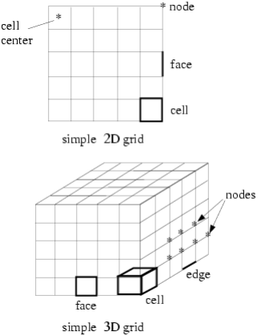

# Fluent UDF 手册

***
# 如何使用手册
***
前言分为以下几个章节：
1. 手册的内容
2. 出版协定
3. 数学公约
***
## 第一章 初识User-Defined Functions (UDFs)
***
这一章包含用户自定义函数（User-Defined Functions）UDF的概览以及他们在ANSYS Fluent的用法。
UDF 功能的包含以下几个部分：  
**1.1  什么是 UDF?**  
**1.2  UDF 的限制**  
**1.3  通过 DEFINE 宏定义你自己的UDF**
**1.4  解释和编译UDF**  
**1.5  将 UDFs 链接到ANSYS Fluent模型**  
**1.6  网格术语**  
**1.7  ANSYS Fluent 的数据类型**  
**1.8  在求解过程中调用UDF的序列问题**  
**1.9  使用多相 UDF 时需要特别注意的事项**
### 1.1 什么是 UDF？
用户自定义函数，或者说UDF，是一个C或者是C++语言编写的功能函数，能够被FLuent动态加载从而增强其基础功能。例如你可以使用UDF来： 
- **自定义边界条件，材料属性定义，表面和体积反应速率，ANSYS Fluent传输方程中的源项，用户定义标量（UDS）传输方程中的源项，扩散函数等**。  
- **在每次迭代中调整数值**。
- **初始化解决方案**。
- **根据需要执行异步UDF**。
- **在一次迭代结束时、退出ANSYS Fluent或加载已编译的UDF库时执行**。
- **增强后处理能力**。
- **增强现有的ANSYS Fluent模型（如离散相模型，多相混合模型，离散纵坐标辐射模型）**。

UDF由.c或.cpp的扩展名标识（例如，myudf.c）。 一个源文件可以包含单个或多个UDF，您可以定义多个源文件。 见附录 [A：C编程基础]()有关C编程的一些基本信息的基础知识。  

UDF使用ANSYS Fluent提供的DEFINE宏定义（参见[DEFINE Macros](#第二章：define-宏)）。他们使用访问ANSYS的附加宏和函数（也由 ANSYS Fluent 提供）编码流畅的求解器数据并执行其他任务。 有关详细信息，请参阅用于编写UDF的其他宏（p.257）。  

每个UDF必须在开头包含udf.h文件包含指令（#include“udf.h”）源代码文件，它既可以定义DEFINE宏，也可以使用其他ANSYS Fluent-提供了宏和函数，并将它们包含在编译过程中。 请参阅包含udf.h源文件中的头文件（p.5）以获取详细信息。  

包含UDF的源文件可以在ANSYS Fluent中解释或编译。
- 对于解释型UDF，源文件在单个步长进程中被解释和加载。
- 对于编译型UDF，进程包含两步。 首先构建一个共享的对象代码库，然后将其加载到ANSYS Fluent中。请参阅[解释UDF]()和[编译UDF]()。

在解释或编译之后，UDF将在ANSYS Fluent对话框中可见和可选，并且可以通过在相应的对话框中选择函数名称来连接到解算器。  
这个过程在 [将UDFs连接到ANSYS Fluent]() 已有描述。

综上，UDFs：
- 是用 C 或 C++ 程序语言编写的。
- 必须通过 ANSYS Fluent 支持的 DEFINE 宏来定义。
- 必须包含 udf.h 头文件。
- 使用预定义的宏和函数来访问ANSYS Fluent求解器数据并执行其他任务。
- 作为解释或编译的函数执行。
- 使用图形用户界面对话框链接到ANSYS Fluent求解器

***
**重要**

正如 [Paral-lelizing Your Serial UDF]() 中所述，我们鼓励您并行化所有您创建或修改的UDF。

***

### 1.2  UDF的限制
UDFs有以下的限制：  
- 虽然ANSYS Fluent中的UDF功能可以满足各种应用，但是无法使用UDF解决每一个应用。 并非所有解决方案变量或ANSYS Fluent模型都可以UDF被访问。如果您不确定是否可以使用UDF处理特定问题，请与技术支持工程师联系以获取帮助。
- UDF使用和返回值都遵循国际单位制，在极少数情况下有例外（[如UNIVER-SAL_GAS_CONSTANT]()）。
- 当您使用新版本的ANSYS Fluent时，可能需要更新UDF。

### 1.3  通过DEFINE Macros定义你自己的UDF
UDF是使用ANSYS Fluent提供的函数声明定义的。 这些函数声明在代码中以宏的形式实现，并在本文档中称为 DEFINE 宏。 DEFINE 宏的定义包含在udf.h头文件中（有关列表，请参阅附录B：[DEFINE 宏定义](#第二章：define-宏))）。有关每个DEFINE宏的完整描述及其用法示例，请参阅 [DEFINE宏](#第二章：define-宏))。

通常一个 DEFINE 宏的格式是这样的：   
`DEFINE_MACRONAME(udf_name, passed-in variables)`

括号中的第一个参数是您提供的UDF的名称。名称参数区分大小写，并且必须以小写形式指定。解释或编译函数后，您在UDF中为UDF选择的名称将在ANSYS Fluent的下拉列表中可见并可选择。DEFINE 宏的第二组输入参数是从ANSYS Fluent求解器传递到你的函数中的变量。

例如，这个宏：  
`DEFINE_PROFILE(inlet_x_velocity, thread, index)`

定义了一个名为 inlet_x_velocity 的边界函数，它有两个变量，即thread 和 index，它们从ANSYS Fluent传递给函数。 这些传入的变量是边界条件区域ID（作为指向线程的指针）和标识要存储的变量的索引。解释或编译UDF后，其名称（**inlet_x_velocity**）将在ANSYS Fluent中相应的边界条件对话框（例如，Velocity入口）的下拉列表中可见并可选择。

***
&emsp;&emsp;**重要**

&emsp;&emsp;当使用UDFs时：
- DEFINE宏的所有参数都需要放在源代码的同一行。将DEFINE语句拆分到多行会导致编译错误。
- 宏之间必须没有空格（例如，DEFINE_PROFILE）和参数的第一个括号，因为这将导致Windows中的错误。
- 不要在源代码的注释中包含DEFINE宏语句（例如​  DEFINE_PROFILE）。 这将导致编译错误。

***
#### 1.3.1  在您的源文件中包含 udf.h 头文件
udf.h 头文件包含：
- DEFINE 宏的定义：
- C 或 C++ 库函数头文件的#include编译器指令
- 其它 ANSYS Fluent 提供的宏和函数的头文件(例如，mem.h)

因此，您必须使用#include编译器指令在每个UDF源代码文件的开头包含udf.h文件：  
`#include "udf.h"`  

例如，当 udf.h 包含在已经包含了上一节中的DEFINE语句的源文件里时，  
`#include "udf.h"`   
`DEFINE_PROFILE(inlet_x_velocity, thread, index)`

在编译时，宏将扩展为:  
`void inlet_x_velocity(Thread *thread, int index)`

***
**重要**

编译UDF时，无需在本地文件夹中放置udf.h的副本。
在您UDF的编译后，ANSYS Fluent解算器会自动从以下文件夹中读取udf.h文件，例如：  
`path\ANSYS Inc\v192\fluent\fluent19.2.0\src\udf`  

其中path是安装ANSYS Fluent的文件夹（默认路径为C:\ Program Files)
***
### 1.4 解释型和编译型 UDFs
包含UDF的源代码文件可以在ANSYS Fluent中解释或编译。在这两种情况下都会编译函数，但是这两种方法编译源代码的方式和编译过程产生的代码是不同的。以下各节将介绍这些差异：

&emsp;&emsp;1.4.1 编译型UDFs 
&emsp;&emsp;1.4.2 解释型UDFs 
&emsp;&emsp;编译型和解释型UDFs的区别

#### 1.4.1  编译型 UDFS
编译型UDF的构建方式与构建ANSYS Fluent可执行文件的方式相同：Makefile脚本用于调用系统 C 或 C++ 编译器来构建目标代码库。通过单击 **Build**，可以在 **Compiled UDFs** 对话框中启动此操作。目标代码库包含高级 C 或 C++ 语言向本机机器语言的转换。在运行时必须通过名为“动态加载”的进程将共享库加载到ANSYS Fluent中。通过单击 **Load**，可以在 **Compiled UDFs** 对话框中启动此操作。对象库特定于所使用的计算机架构，以及正在运行的ANSYS Fluent可执行文件的版本。因此，在ANSYS Fluent进行升级、计算机操作系统级别更改或作业在不同类型的计算机上时必须重建库。

综上，编译型UDF分为两步使用图形用户界面通过源文件编译。该过程涉及 **Compiled UDFs** 对话框，首先从源文件构建共享库目标文件，然后加载刚刚构建到ANSYS Fluent中的共享库。

#### 1.4.2 解释型 UDFs
解释型 UDFs 使用图形用户界面通过源文件进行解释，并在单步进程中完成。该过程在运行时，需要使用 **Interpreted UDFs** 对话框，并在这里 **Interpret** 你的源文件。

在ANSYS Fluent中，源代码使用 C 预处理器编译为中间级的，与架构无关的机器代码。然后，当调用 UDF 时，此机器代码在内部仿真器或解释器上执行。这一额外的代码层会导致性能下降，但可以在不同的架构，操作系统和ANSYS Fluent版本之间轻松共享解释型UDF。如果执行速度确实成为了问题，依然可以将解释型UDF运行在编译模式下，并且无需修改。

用于解释UDF的解释器不具备标准 C 编译器（用于编译型 UDF）的所有功能，并且并不是支持所有的并行 UDF 宏。有关限制的详细说明，请参阅限制（第340页）。

***
**注意**

在某些情况下，您的解释型UDF可能会遇到与 Fluent 分配的 C 预处理器（CPP）相关的错误。作为解决方法，您可以在 **Interpreted UDFs** 对话框的 **CPP Command Name f** 字段中输入系统预处理器的完整路径; 例如，/usr/bin/cpp 或 gcc -E（仅限 Linux)。

***

#### 1.4.3 解释型与编译型 UDFs 的区别
解释型和编译型 UDF 之间的主要区别在于解释型UDF无法使用直接结构引用访问ANSYS Fluent 求解器数据; 它们只能通过使用ANSYS Fluent提供的宏间接访问数据。当您要在 UDF 中引入新的数据结构，这一点可能会很重要。

以下是解释型和编译型UDF之间差异总结:  
- 解释性 UDF
  - 可移植到其它平台
  - 都可以作为编译的UDF运行
  - 不需要 C 编译器
  - 执行速度比编译型UDF慢
  - 对 C 编程语言的使用有所限制
  - 不能用 C++ 编写
  - 无法链接到已编译的系统或用户库
  - 只能使用预定义的宏访问存储在ANSYS Fluent结构中的数据（请参阅其他宏）用于编写 UDF（p.257）。
有关在ANSYS Fluent中解释型UDF的详细信息，请参阅 ANSYS Fluent 的 **Interpreting UDFs (p. 339)** 。
- 编译型UDF
  - 执行速度比解释型UDF更快
  - 不限制使用 C 或 C++ 编程语言
  - 可以调用其它的语言编写的函数（具体取决于系统和编译器）
  - 如果它们包含解释器无法处理的某些C语言元素，则不一定能够作为解释型UDF运行
有关在ANSYS Fluent中解释型UDF的详细信息，请参阅 ANSYS Fluent 的**Compiling UDFs (p. 345)** 。

因此，在为您的ANSYS Fluent模型选择要使用的UDF模型时：
- 将解释型 UDF 用于小而简单的函数
- 将编译型 UDF 用于以下复杂函数
  - 具有较强的 CPU 要求（例如，每次迭代需要在每个单元的基础上调用的属性UDF）
  - 需要访问共享库。

### 1.5  将 UDFs 链接到ANSYS Fluent模型
当你的 UDF 源文件被解释或编译之后，解释的代码或共享库中包含的函数将显示在对话框的下拉列表中，随时可以激活或 **“hook”** 到CFD模型。有关如何将 UDF 链接到 ANSYS Fluent 的详细信息，请参阅 **Hooking UDFs to ANSYS Fluent (p. 369)**。

### 1.6  网格术语
大多数用户定义的函数从 ANSYS Fluent 求解器访问数据。因为求解器数据是根据网格组件定义的，所以在书写 UDF 之前，您需要先学习一些基本的网格术语。

网格被离散为控制体积或单元格。每个单元由一组节点，一个单元中心和绑定单元的面定义（图1.1：网格组件（第9页））。 ANSYS Fluent使用内部数据结构来定义网格的域; 为网格中的单元格，单元格面和节点分配顺序; 并建立相邻单元之间的连通性。

线程是 ANSYS Fluent 中的一种数据结构，用于存储边界或单元区域的信息。单元格线程是单元格的分组，而面线程是面的分组。指向线程数据结构的指针通常传递给函数，并在 ANSYS Fluent 中进行操作，以访问每个线程表示的边界或单元区域的信息。在“边界条件”对话框中的 ANSYS Fluent 模型中定义的每个边界或单元格区域都有一个整数区域ID，该ID与该区域中包含的数据相关联。你不会看到"thread"这个词

单元格和单元格面被分组到通常定义模型物理组件的区域中(例如，入口（inlet），出口(outlet)，壁面(walls)，流体区域(fluid regions))。一个面将绑定一个或两个单元格，这取决于它是一个边界面还是一个内部面。域是ANSYS Fluent中的一种数据结构，用于存储网格中节点、面线程和单元线程集合的信息。

图 1.1  网格组件   

**node（节点）**  
&emsp;&emsp;一个网格点

**node thread（节点链）**  
&emsp;&emsp;一组node

**edge（边线）**  
&emsp;&emsp;面的边界（3D）

**face（面）**  
&emsp;&emsp;单元的边界（2D 或者 3D）

**face thread（面链）**
&emsp;&emsp;一组面

**cell（网格）**  
&emsp;&emsp;域离散出的控制体

**cell center（网格中心）**  
&emsp;&emsp;存储单元数据的位置

**cell thread（网格链）**  
&emsp;&emsp;一组网格

**domain（域）**  
&emsp;&emsp;一组节点、面和网格

### 1.7 ANSYS Fluent 中的数据类型
除了标准的 C 和 C++ 语言数据类型(如real、int等)，您还可以使用它们在UDF中定义数据，还有与求解器数据相关联的ANSYS特定于流的数据类型。这些数据类型表示网格的计算单元([图1.1：网格组件]())。使用这些数据类型定义的变量通常作为参数提供给定义宏，以及访问ANSYS Fluent求解器数据的其他特殊函数。

一些最常使用的数据类型是：  
**Node**  
&emsp;&emsp;一个结构体数据类型

**face_t**   
&emsp;&emsp;一个整型数据类型，用于标识 face 链中的特定 face。

**cell_t**  
&emsp;&emsp;一个整型数据类型，用于标识 cell  链中的特定 cell。

**Thread**  
&emsp;&emsp;一种结构数据类型，用于存储它所表示的单元格组或面组所共有的数据。在线程数据类型中，有一个指针数组(存储)，每个指针指向特定字段变量(如压力、速度或梯度)的单元格或面值数组。在该指针数组中，用于标识指向特定字段变量数组(单元格或面值)的指针的索引类型为**Svar**。对于多相应用程序，每个阶段以及混合物都有一个线程结构。参阅多相特定数据类型（[Multiphase-specific Data Types ]()）

**Svar**
An index used to identify a pointer in the Thread storage. All possible values for this index variable are given in the enumeration of that type in the file src/storage/storage.h. Note that some values are generated using macros like SV_[COUPLED_]SOLUTION_VAR[_WITH_FC](...), SV_UDS_I(...) or SV_UDSI_G(...) and are therefore not found explicitly in the enumeration. If a pointer in the storage array of pointers still has the value NULL, memory for the corresponding field variable has not been allocated yet. A call to the function Alloc_Storage_Vars(domain, SV_..., ..., SV_NULL); can be used to change that allocation. The expression if (NULLP(THREAD_STORAGE(t, SV_...))) can be used to test whether the memory for a particular field variable has already been allocated on a given Thread or not.

**Domain**
A structure data type that stores data associated with a collection of node, face, and cell threads in a mesh.For single-phase applications, there is only a single domain structure. For multiphase applications, there are domain structures for each phase, the interaction between phases, as well as for the mixture. The mixture-level domain is the highest-level structure for a multiphase model. See Multiphase-specific Data Types (p. 14) for details.

***
&emsp;&emsp;**重要**  
&emsp;&emsp;所有的数据类型都有大小写的区别。
***

当您在 ANSYS Fluent 中使用 UDF 时，您的函数可以访问流体和边界区域中单个网格或网格面的解变量。UDFs 需要传递适当的参数，例如线程引用(即指向特定线程的指针)和网格或面 ID，以便能够访问单个网格或面。注意，face ID 或 cell ID 本身并不能惟一地标识 face 或 cell。始终需要一个线程指针和ID来标识 face (或单元格)所属的线程。

一些 UDFs 可能会

***
## 第二章：DEFINE 宏
***
这一章包含了您定义 UDF 将会用到的 DEFINE 宏的描述。

主要包含以下几节：  
[2.1 介绍](##2.1-介绍)  
[2.2 介绍]()  
[2.3 介绍]()  
[2.4 介绍]()  
[2.5 介绍]()  
[2.6 介绍]()  
[2.7 介绍]()  

### 2.1 介绍

### 2.2 介绍

### 2.3 介绍

### 2.4 介绍
